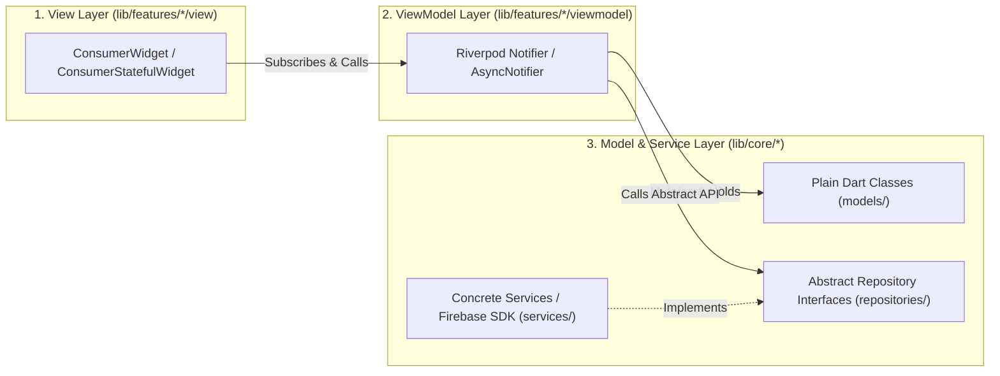
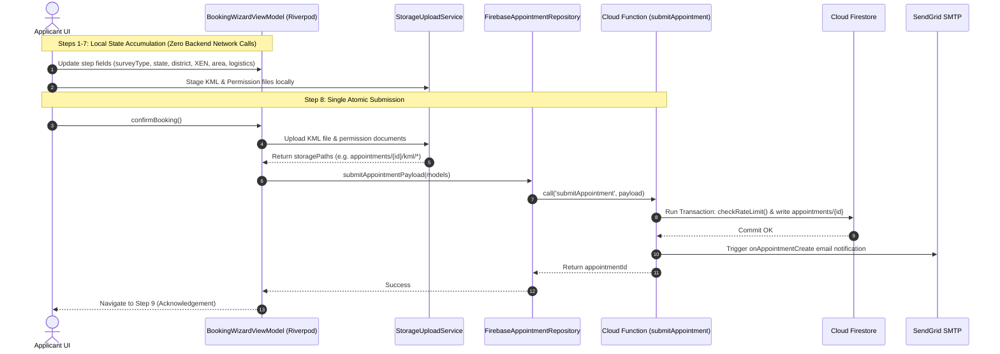

# 🏛️ Architecture, Data Flow & Request Lifecycle

**Parent Index:** [brain.md](file:///d:/flutter%20projects/survey_booking_app/brain/brain.md)

---

## 1. Architectural Pattern: 3-Layer MVVM

The project follows a pragmatic 3-layer MVVM pattern (no redundant UseCase/Interactor layer) enforcing clean separation of concerns:



### Layer Responsibilities & Rules
- **View (`features/*/view/`):** Pure UI widgets (`ConsumerWidget` / `LayoutBuilder`). Responsible for rendering state, capturing input, and invoking ViewModel methods. **Zero direct Firebase SDK calls.**
- **ViewModel (`features/*/viewmodel/`):** Riverpod `Notifier` or `AsyncNotifier`. Holds feature UI state, performs local validation, coordinates repository calls. **Depends only on abstract repository interfaces in `core/repositories/`.**
- **Model & Repositories (`core/models/` & `core/repositories/`):** Plain Dart data classes matching Firestore schema. Abstract repository interfaces (`AppointmentReader`, `AppointmentWriter`, `UserRepository`, `AuditLogRepository`).
- **Services (`core/services/`):** Concrete implementations of repository interfaces (`FirebaseAppointmentRepository`, `FirebaseUserRepository`, `StorageUploadService`, `CloudFunctionsService`). **This is the ONLY layer that touches Firebase SDKs.**

---

## 2. Data Flow & Request Lifecycle

### Booking Wizard Request Lifecycle (Steps 1–8)



---

## 3. Feature Independence & SOLID Principles

### Feature Independence Rules
1. A feature inside `features/<name>/` may freely import from `core/`.
2. A feature **MUST NEVER** import from another feature's `view/` or `viewmodel/`.
3. Cross-feature communication occurs exclusively through shared `core/` state (e.g., auth session provider, shared repository data).
4. Cross-feature navigation is performed via `go_router` named routes defined in `core/routing/`.

```
✅ PERMITTED:  lib/features/booking_wizard/viewmodel/ -> lib/core/repositories/
❌ FORBIDDEN:  lib/features/admin_dashboard/view/    -> lib/features/committee_review/viewmodel/
```

### SOLID Implementation Mapping
- **Single Responsibility (SRP):** Views render UI; ViewModels manage state; Repositories wrap Firebase SDK operations.
- **Open/Closed (OCP):** Config-driven wizard steps (`List<WizardStepConfig>`) and survey types (`SurveyType` enum). Adding survey types requires enum/config additions, not switch refactoring.
- **Liskov Substitution (LSP):** `AppointmentRepository` abstract interface allows seamless substitution of `FirebaseAppointmentRepository` with `FakeAppointmentRepository` in unit tests.
- **Interface Segregation (ISP):** `AppointmentRepository` is split into `AppointmentReader` (read-only queries for dashboards) and `AppointmentWriter` (mutation methods for wizard and admin).
- **Dependency Inversion (DIP):** ViewModels depend on abstract interfaces injected via Riverpod providers (`appointmentReaderProvider`, `appointmentWriterProvider`), initialized in `main.dart`.

---

## 4. Responsive & Adaptive Window Size Strategy

Layout adaptation uses Material 3 window size classes evaluated via `LayoutBuilder` in `core/layout/`:

| Window Class | Width (dp) | Implementation Strategy |
|---|---|---|
| **Compact** | `< 600dp` | Primary target (Mobile portrait). 4-column layout, 16dp margins, bottom navigation. |
| **Medium** | `600dp - 840dp` | Tablet / Foldable unfolded. `LayoutBuilder` branch scales Compact views smoothly. |
| **Expanded** | `> 840dp` | Desktop / Web. 12-column layout tokens, dual-pane Master-Detail view ready. |

---

## 5. Web-Readiness Boundary

To ensure the mobile codebase is future-web-compatible without requiring architectural rewrites:
- **Routing:** Built on `go_router` with URL path mappings instead of imperative `Navigator.push`.
- **PDF Viewing:** Uses `pdfx` (multi-platform: Android, iOS, Web, Desktop) instead of `flutter_pdfview`.
- **File Handling:** External file operations wrapped behind `FileOpenService` interface to isolate non-web `open_file` package calls.
