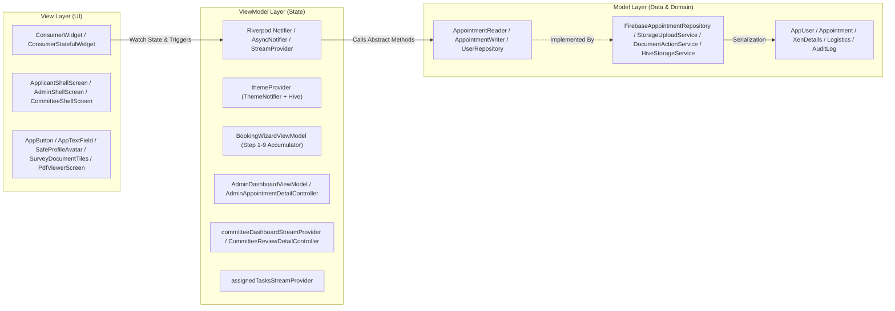
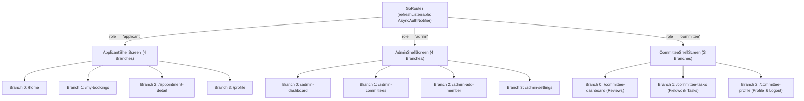
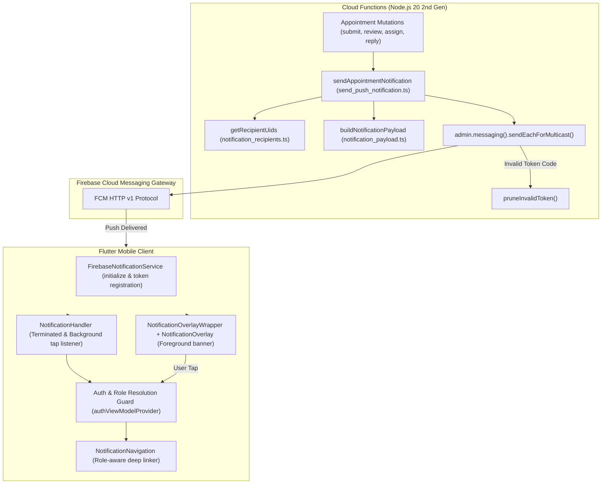

# 🏗️ System Architecture, Design Patterns & Core Principles

**Parent Index:** [brain.md](file:///d:/flutter%20projects/survey_booking_app/brain/brain.md)

---

## 1. 3-Layer MVVM Architectural Pattern

The application enforces a **3-Layer MVVM (Model-View-ViewModel)** architecture:

### Layer Responsibilities:
1. **View (UI Layer):** `ConsumerWidget` / `ConsumerStatefulWidget`. Renders widgets, handles layout via `flutter_screenutil_plus` & `AppBreakpoints`, listens to Riverpod state. Zero direct Firebase SDK calls. Sub-widgets are split into focused `StatelessWidget` subclasses to minimize unnecessary widget rebuild scopes.
2. **ViewModel (State Layer):** Riverpod `Notifier`, `AsyncNotifier`, `StreamProvider.autoDispose`, and imperative Controllers. Holds local and async feature state, orchestrates repository invocations, applies business validation rules, and checks RBAC rights.
3. **Model (Data Layer):** Plain Dart data classes (`AppUser`, `Appointment`, etc.) + Abstract Repositories (`core/repositories/`) + Concrete Firebase implementations (`core/services/`).

---

## 2. SOLID Principles Applied

- **Single Responsibility Principle (SRP):** Views render UI only. ViewModels manage state only. Repositories handle data persistence only.
- **Open/Closed Principle (OCP):** Config-driven survey types (`SurveyType` enum), status badges (`AppointmentStatus`), and wizard steps (`List<WizardStepConfig>`).
- **Liskov Substitution Principle (LSP):** Abstract repository interfaces (`AppointmentRepository`, `UserRepository`, `AuditLogRepository`) allow fully mockable repository implementations for unit testing without touching Firebase.
- **Interface Segregation Principle (ISP):** `AppointmentRepository` is split into `AppointmentReader` (read-only queries for dashboards & queues) and `AppointmentWriter` (mutations). Features depend only on the interface they consume.
- **Dependency Inversion Principle (DIP):** Feature ViewModels depend exclusively on abstract repository interfaces declared in `core/repositories/`, injected via Riverpod providers (`appointmentRepositoryProvider`, `userRepositoryProvider`).

---

## 3. Feature-First Modularity Rules

1. **Self-Contained Modules:** Code inside `lib/features/<feature>/` contains its own `view/` and `viewmodel/` directories.
2. **Strict Import Rule:** A feature may freely import from `lib/core/`. A feature may **NEVER** import from another feature's `view/` or `viewmodel/` directory.
3. **Cross-Feature Communication:** Handled solely via shared `core/` state (e.g., auth state, repository providers) or `GoRouter` navigation.
4. **Deletability Rule:** Deleting any single feature directory in `lib/features/` should cause zero compilation errors outside that directory (excluding route registration).

---

## 4. Multi-Role Shell Architecture

The app provides three independent, persistent bottom navigation shells matching user personas:

---

## 5. Reactive Streaming & Stream Provider Auto-Dispose Pattern

To eliminate memory leaks, prevent stale background Firestore listeners, and ensure instant UI updates:
- **`committeeDashboardStreamProvider` (`StreamProvider.autoDispose`)**: Subscribes to `watchCommitteeReviewAppointments(uid)`. Automatically terminates the stream listener when the user navigates away or logs out.
- **`assignedTasksStreamProvider` (`StreamProvider.autoDispose`)**: Subscribes to `watchCommitteeAssignedTasks(uid)` for real-time task queue updates.
- **`committeeReviewDetailStreamProvider` (`StreamProvider.autoDispose.family`)**: Subscribes to `watchAppointmentById(id)` on the review detail screen.
- **`adminAppointmentDetailStreamProvider` (`StreamProvider.family`)**: Streams real-time appointment document updates to the Admin inspector.

---

## 6. Theme & Responsiveness Architecture

- **Theme Engine:** Light and Dark themes defined in `lib/core/theme/app_theme.dart` using `AppColors` and `FlexColorScheme` (v8.4.0, Green M3). `ResponsiveTheme.fromTheme(...)` ensures text styles scale fluidly.
- **Theme Persistence:** `themeProvider` (`ThemeNotifier` using Riverpod) manages `ThemeMode.light`, `ThemeMode.dark`, and `ThemeMode.system` backed by `HiveStorageService` (`settingsBox`).
- **Screen Scaling:** `ScreenUtilPlusInit` initialized in `main.dart` with `designSize: Size(375, 812)`, `minTextAdapt: true`, `splitScreenMode: true`, and `autoRebuild: false` for high-performance targeted scope rebuilds.
- **Graceful Error Handling:** Domain failure hierarchy (`failures.dart`) translates network, auth, and server exceptions into human-readable alerts displayed via `AppSnackbar`. Isolated error and retry views prevent network hiccups from breaking unaffected screen sections.

---

## 7. Cloud Functions Service Gateways Architecture

The application defines two specialized service gateways for invoking Firebase Cloud Functions:
1. **`AdminFunctionsService` (`lib/core/services/admin_functions_service.dart`)**:
   - Used for authenticated administrative operations (e.g. `createCommitteeAccount`).
   - Performs client-side pre-flight admin claim validation (`authState.value?.isAdmin == true`).
   - Forces session token refreshes (`user.getIdToken(true)`) to avoid stale unauthenticated errors.
   - Translates `FirebaseFunctionsException` into `ValidationFailure`, `AuthFailure`, or `ServerFailure`.
2. **`AuthFunctionsService` (`lib/core/services/auth_functions_service.dart`)**:
   - Used for unauthenticated auth operations (`authenticateUser`, `registerApplicant`, `requestPasswordReset`).
   - Requires zero pre-flight auth checks (the caller is unauthenticated by definition).
   - Serves as the client bridge for server-mediated rate limiting.
   - Extracts server-provided `secondsRemaining` from `FirebaseFunctionsException` (`code: 'resource-exhausted'`) and maps to `AuthRateLimitFailure(message, secondsRemaining)`.

---

## 8. Push Notification System & In-App Banners Architecture

The application implements an end-to-end Firebase Cloud Messaging (FCM) push notification system with in-app banner overlays, deep linking, and server-side recipient resolution:

### Architectural Rules & Separation of Concerns:
1. **Direct SDK Isolation:** `FirebaseNotificationService` (`lib/core/services/firebase_notification_service.dart`) is the **ONLY** class in the Flutter client permitted to call `FirebaseMessaging.instance`. ViewModels, handlers, and routers consume the abstract `NotificationService` interface.
2. **Top-Level Background Handler:** `_firebaseMessagingBackgroundHandler` is a top-level `@pragma('vm:entry-point')` function executing in a background isolate for pure data payloads.
3. **Tri-State Lifecycle Support:**
   - **Foreground:** `FirebaseMessaging.onMessage` emits to `foregroundMessages`. `NotificationOverlayWrapper` sits above shell navigation and presents an animated top banner with green accent, type-specific icons, auto-dismiss (4s timer), swipe-to-dismiss, and tap-to-navigate.
   - **Background:** `FirebaseMessaging.onMessageOpenedApp` emits to `notificationOpened`, processed by `NotificationHandler`.
   - **Terminated:** `getInitialNotification()` retrieves the launch message in `NotificationHandler.initState()`.
4. **Auth-Gate Deep Linking:** In `NotificationNavigation.navigate(context, ref, message)` and `NotificationHandler`, navigation never triggers before authentication and role resolution are complete. If auth is pending, navigation is safely deferred until `authViewModelProvider.value` resolves. Routes map strictly by role:
   - `booking_created` $\rightarrow$ `/admin-dashboard`
   - `reviewer_assigned`, `clarification_requested`, `booking_approved`, `booking_rejected` $\rightarrow$ `/appointment-detail/:id` (Applicant)
   - `clarification_replied` $\rightarrow$ `/committee-review/:id` (Reviewer)
   - `task_assigned` $\rightarrow$ `/committee-task/:id` (Fieldwork Member)
5. **Token Lifecycle & Security:**
   - Tokens registered upon login via `FieldValue.arrayUnion([token])` in `users/{uid}.fcmTokens` and removed on logout / account switch via `FieldValue.arrayRemove([token])`.
   - Token rotation handled via `FirebaseMessaging.instance.onTokenRefresh`.
   - `firestore.rules` enforces type and size limits: `request.resource.data.fcmTokens is list && request.resource.data.fcmTokens.size() <= 10` to eliminate DoS / resource exhaustion vectors.

