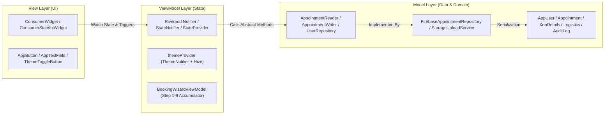

# 🏗️ System Architecture, Design Patterns & Core Principles

**Parent Index:** [brain.md](file:///d:/flutter%20projects/survey_booking_app/brain/brain.md)

---

## 1. 3-Layer MVVM Architectural Pattern

The application enforces a **3-Layer MVVM (Model-View-ViewModel)** architecture:

### Layer Responsibilities:
1. **View (UI Layer):** `ConsumerWidget` / `ConsumerStatefulWidget`. Renders widgets, handles layout via `flutter_screenutil_plus` & `AppBreakpoints`, listens to Riverpod state. Zero direct Firebase SDK calls.
2. **ViewModel (State Layer):** Riverpod `Notifier` / `StateNotifier`. Holds local and async feature state, orchestrates repository invocations, applies business validation rules.
3. **Model (Data Layer):** Plain Dart data classes (`AppUser`, `Appointment`, etc.) + Abstract Repositories (`core/repositories/`) + Concrete Firebase implementations (`core/services/`).

---

## 2. SOLID Principles Applied

- **Single Responsibility Principle (SRP):** Views render UI only. ViewModels manage state only. Repositories handle data persistence only.
- **Open/Closed Principle (OCP):** Config-driven survey types (`SurveyType` enum) and wizard steps (`List<WizardStepConfig>`).
- **Liskov Substitution Principle (LSP):** Abstract repository interfaces (`AppointmentRepository`, `UserRepository`) allow fully mockable repository implementations for unit testing without touching Firebase.
- **Interface Segregation Principle (ISP):** `AppointmentRepository` is split into `AppointmentReader` (read-only queries for dashboards) and `AppointmentWriter` (mutations). Features depend only on the interface they consume.
- **Dependency Inversion Principle (DIP):** Feature ViewModels depend exclusively on abstract repository interfaces declared in `core/repositories/`, injected via Riverpod providers.

---

## 3. Feature-First Modularity Rules

1. **Self-Contained Modules:** Code inside `lib/features/<feature>/` contains its own `view/` and `viewmodel/`.
2. **Strict Import Rule:** A feature may freely import from `lib/core/`. A feature may **NEVER** import from another feature's `view/` or `viewmodel/` directory.
3. **Cross-Feature Communication:** Handled solely via shared `core/` state (e.g., auth state, repository providers) or `GoRouter` navigation.
4. **Deletability Rule:** Deleting any single feature directory in `lib/features/` should cause zero compilation errors outside that directory (excluding route registration).

---

## 4. Theme & Responsiveness Architecture

- **Theme Engine:** Light and Dark themes defined in `lib/core/theme/app_theme.dart` using `AppColors`. `ResponsiveTheme.fromTheme(...)` ensures text styles scale fluidly.
- **Theme Persistence:** `themeProvider` (`ThemeNotifier` using Riverpod) manages `ThemeMode.light`, `ThemeMode.dark`, and `ThemeMode.system` backed by `Hive.initFlutter()` storage (`settingsBox`).
- **Screen Scaling:** `ScreenUtilPlusInit` initialized in `main.dart` with `designSize: Size(375, 812)`, `minTextAdapt: true`, `splitScreenMode: true`, and `autoRebuild: false` for high-performance targeted scope rebuilds.
