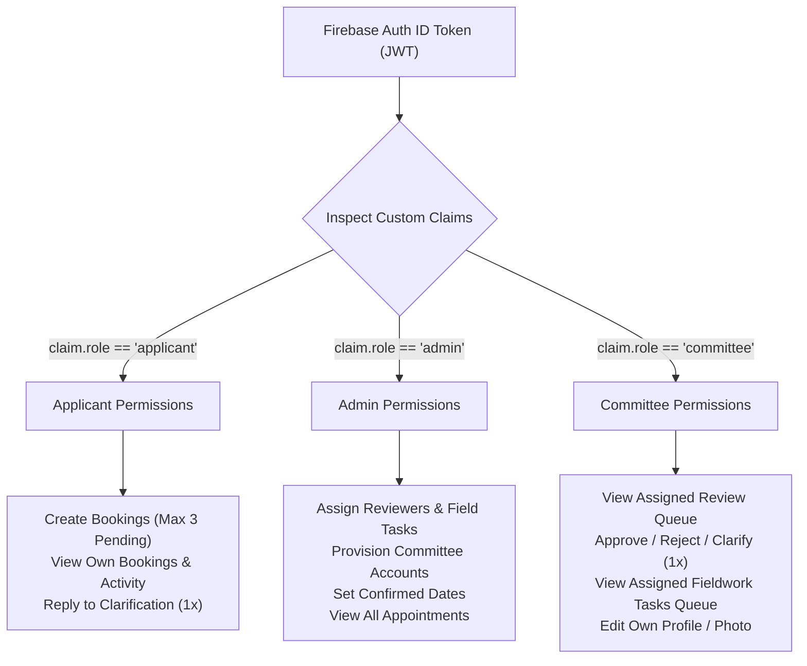
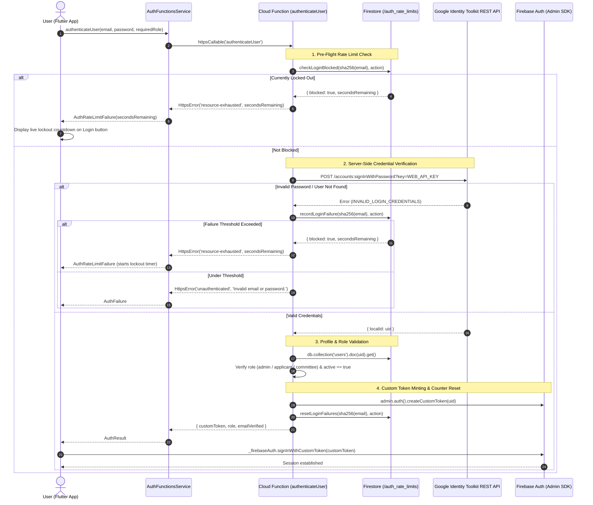
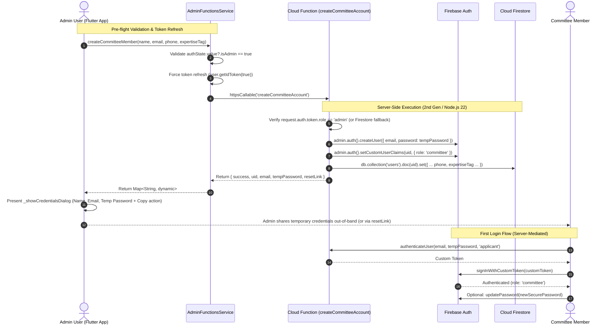
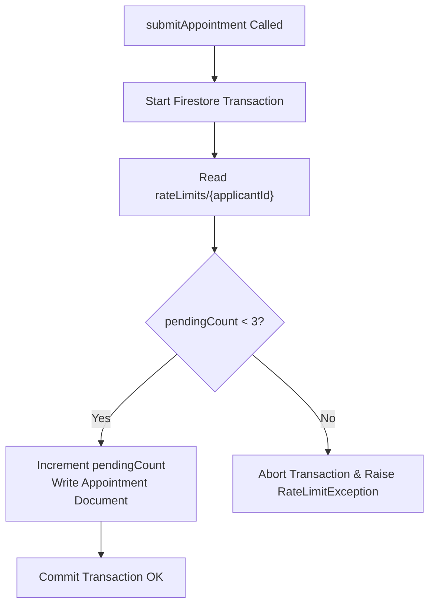
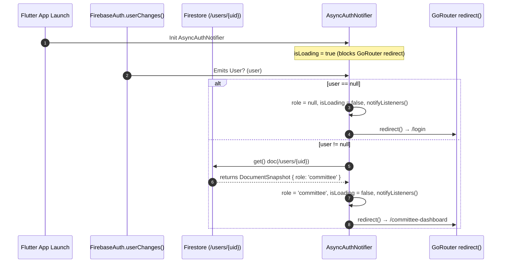
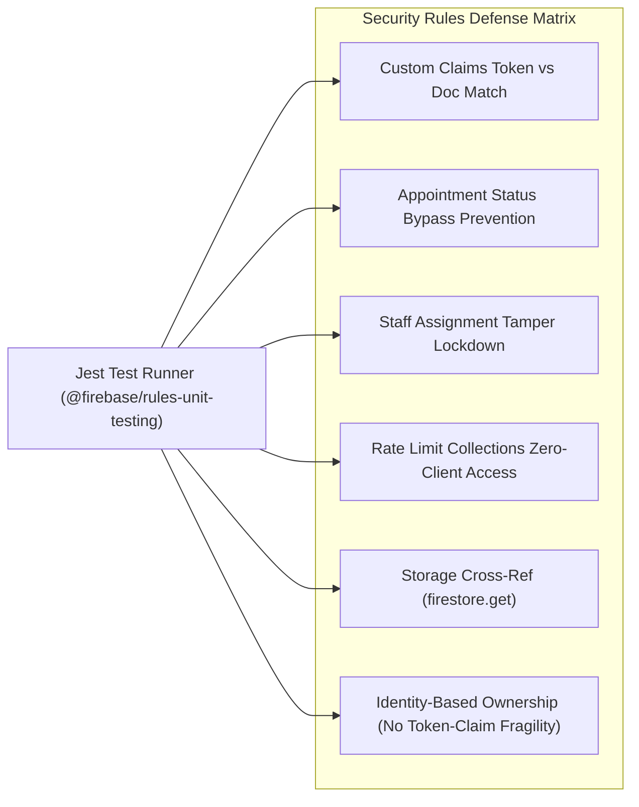

# 🔒 Authentication, Security & Authorization Rules

**Parent Index:** [brain.md](file:///d:/flutter%20projects/survey_booking_app/brain/brain.md)

---

## 1. Role-Based Access Control (RBAC) Architecture

Authentication relies on Firebase Auth paired with custom Auth claims set server-side via the Firebase Admin SDK:



> **SECURITY PRINCIPLE:** Client-side user document fields (`users/{uid}.role`) are NEVER trusted for security decisions. All Firestore and Storage Security Rules inspect `request.auth.token.role` exclusively.

---

## 2. Server-Mediated Authentication Gateway & Rate Limiting (Option A)

### 2.1 Threat Model & Rationale
In standard Firebase mobile applications, the Flutter SDK talks directly to Google's Identity Toolkit endpoints (`identitytoolkit.googleapis.com`) using the Web API Key bundled inside `google-services.json`. Any client-side rate limit or pre-flight check can be bypassed by an attacker issuing direct HTTP requests.

To guarantee **100% server enforcement**, all sensitive auth vectors are routed through 2nd Gen HTTPS Callable Cloud Functions backed by the Firebase Admin SDK:
1. **Login (Applicant & Admin)**: Credential verification and progressive account lockouts.
2. **Signup (Applicant)**: Bot flood mitigation and mass-registration throttling.
3. **Password Reset**: Inbox flooding/spam prevention.

> **Security Distinction: Network Reachability vs Authorization:**  
> The 2nd Gen Cloud Functions declare `invoker: "public"` (`roles/run.invoker` for `allUsers`) at the Cloud Run network proxy layer because unauthenticated mobile users do not possess Google Cloud corporate IAM employee accounts. This grants **network reachability only**. Security and authorization are enforced strictly inside the function code (password verification via Identity Toolkit, atomic Firestore rate-limiting lockouts, role verification, and Firebase App Check via Google Play Integrity).



### 2.2 Rate Limiting Policies & Thresholds

| Flow | Rate Limit Strategy | Window | Allowed Before Block | Lockout Action |
|---|---|---|---|---|
| **Applicant Login** | Failure-based (consecutive) | 15 minutes | 5 failed attempts | **15-minute lockout** (30-min on repeat lockout) |
| **Admin Login** | Failure-based (consecutive) | 15 minutes | 3 failed attempts | **30-minute lockout** (60-min on repeat lockout) |
| **Applicant Signup** | Count-based (all attempts) | 60 minutes | 3 requests per email | **60-minute block** |
| **Password Reset** | Count-based (all requests) | 60 minutes | 3 requests per email | **60-minute block** (+ 60s client cooldown) |

### 2.3 Rate Limit Storage Schema (`/auth_rate_limits/{docId}`)
Stored in a dedicated, tamper-proof Firestore collection where `docId` is `{action}_{sha256(email)}`:
- **PII Protection**: Plaintext email addresses are **never** used as document IDs or stored in plaintext in rate limit documents.
- **Fields**:
  ```typescript
  interface AuthRateLimitDoc {
    identifierHash: string; // SHA-256 hex hash of normalized email
    action: string;         // 'login_applicant' | 'login_admin' | 'signup' | 'password_reset'
    failureCount?: number;  // Used by login
    requestCount?: number;  // Used by signup / password reset
    firstFailureAt?: Timestamp;
    windowStart?: Timestamp;
    lastActivityAt: Timestamp;
    blockedUntil: Timestamp | null;
    lockoutCount?: number;  // Escalates lockout for repeat offenders
  }
  ```
- **Security Rule Enforcement**: Exclusively accessible via Firebase Admin SDK in Cloud Functions:
  ```javascript
  match /auth_rate_limits/{docId} {
    allow read, write: if false; // Strict zero-client-access
  }
  ```

### 2.4 Flutter Client Integration (`AuthFunctionsService`)
- **`AuthFunctionsService` (`lib/core/services/auth_functions_service.dart`)**: Lightweight unauthenticated Cloud Function caller (no admin pre-flight claim checks required since the caller is not logged in).
- **Domain Failure Translation**:
  - `resource-exhausted` maps to `AuthRateLimitFailure(message, secondsRemaining)`.
  - `unauthenticated` / `permission-denied` maps to `AuthFailure(message)`.
  - `already-exists` maps to `AuthFailure('An account with this email already exists.')`.
- **UI Lockout Feedback**:
  - `ApplicantLoginScreen` and `AdminLoginScreen` maintain `_loginLockoutSeconds` driven by the server's `secondsRemaining`.
  - While locked, the Login button is disabled and its label switches dynamically to `Locked (Xs)`.
  - `ApplicantSignupScreen` catches `AuthRateLimitFailure` and displays an explicit "Signup Blocked" error snackbar.

---

## 3. Authentication & Provisioning Flows

All administrative Cloud Functions in Flutter must route through `AdminFunctionsService` (`lib/core/services/admin_functions_service.dart`). The service validates admin claims locally before network dispatch, forces a session token refresh (`getIdToken(true)`), checks for valid local session existence, and translates raw `FirebaseFunctionsException` codes into structured `Failure` types (`ValidationFailure`, `AuthFailure`, `ServerFailure`, `NetworkFailure`).



### 3.1 Committee Provisioning & Credentials Presentation
- **Secure Server-Side Password Generation:** `createCommitteeAccount` (`functions/src/index.ts`) creates a temporary password (`Temp@...`) and optionally a password reset link.
- **Immediate Administrative Presentation:** Unlike traditional blind provisioning where credentials are lost if email dispatch is unconfigured, the Cloud Function response is passed back through `AdminFunctionsService` and `CommitteeManagementViewModel` to `AddCommitteeMemberScreen`.
- **Non-Dismissible Credentials Dialog (`_showCredentialsDialog`):**
  - Renders the member's Name, Email, and Temporary Password using `SelectableText` in dedicated `_CredentialRow` tiles.
  - `barrierDismissible: false` ensures the admin cannot accidentally dismiss the dialog by tapping outside.
  - **One-Touch Clipboard Copy:** Formats all credentials into a standard template (`Name: ...\nEmail: ...\nTemporary Password: ...`) and copies to the clipboard with an instant feedback toast.
  - **Safe Navigation Lifecycle:** The form reset and screen pop/redirect occur only after the admin clicks "Done", guarded by `if (!mounted) return;` to prevent memory leaks or context use across async boundaries.
- **First Login & Password Change:** The committee member can sign in using their assigned email and temporary password via `authenticateUser`, or use the "Forgot Password" self-service reset link if preferred.

### 3.2 Resilient Admin Role Verification & Custom Claims Backfilling
- **Problem Statement (Stale ID Tokens & Unauthenticated Errors):** In 2nd Gen callable Cloud Functions, `request.auth.token` reflects the claims present at the moment the client's current ID token was minted. When an admin logs in, has their claims set/refreshed, or if the client token is briefly stale, `request.auth.token.role` may be absent or undefined. A rigid guard (`if (token.role !== 'admin') throw new HttpsError(...)`) causes legitimate admins to experience `unauthenticated` or `permission-denied` errors during administrative mutations.
- **Hardened Async Guard Pattern (`requireAdmin` in `admin_appointment_mutations.ts`):**
  1. **Authentication Check:** Immediately rejects requests where `!request.auth` with `HttpsError("unauthenticated", "You must be signed in to perform this action.")`.
  2. **Deactivation Check:** Reads `/users/{uid}` in Firestore. If `active === false` or `isActive === false`, rejects with `HttpsError("permission-denied", "Your account has been deactivated. Contact your administrator.")`.
  3. **Fast-Path Custom Claim:** If `request.auth.token.role === "admin"`, access is immediately granted without additional overhead.
  4. **Firestore Document Role Fallback & Auto-Backfill:** If the custom claim is absent, checks `/users/{uid}.role === "admin"`. If confirmed in Firestore, the function invokes `await auth.setCustomUserClaims(callerUid, {role: "admin"})` to self-heal the Auth user claims for subsequent requests, then grants access.
  5. **Unauthorized Rejection:** If neither check passes, rejects with `HttpsError("permission-denied", "Only administrators can perform this action.")`.
- **Client-Side Synergy (`AdminFunctionsService` & `AdminAppointmentDetailController`):**
  - `AdminFunctionsService` executes `await user.getIdToken(true)` prior to every admin function dispatch to refresh claims.
  - Translates `failed-precondition` to `ValidationFailure`, and formats `unauthenticated` to prompt for re-login.
  - Controllers use `on Failure { rethrow; }` so domain failure messages bubble up cleanly to UI snackbars.

---

## 4. Applicant Signup & Email Verification Flow

- **Server-Mediated Signup (`registerApplicant`)**: Instead of calling `createUserWithEmailAndPassword` directly, the Flutter client calls the `registerApplicant` Cloud Function via `AuthFunctionsService`. The function creates the Auth user via Admin SDK, provisions the `/users/{uid}` document, sets the custom claim, and mints a custom token. The Flutter client calls `signInWithCustomToken()` to establish the session, then calls `user.sendEmailVerification()` using the active session before throwing `EmailNotVerifiedException`.
- **Exception-Driven Routing:** The `AuthViewModel` intentionally throws a custom `EmailNotVerifiedException` during `loginApplicant` or `signupApplicant` if the user's `emailVerified` flag is false. The login/signup UI catches this exception and redirects to the dedicated `/verify-email` route.
- **Session Lifecycles:** Instead of signing out an unverified user, the Firebase Auth session is deliberately kept active. This allows the `/verify-email` screen to seamlessly perform `user.reload()` to check status or call `user.sendEmailVerification()` without prompting for credentials again.
- **Abuse Prevention (60s Cooldown & Server Limit):** The "Resend Verification Email" functionality enforces a strict 60-second cooldown UI timer. Signup is rate-limited on the server to max 3 registrations per email per hour.
- **Orphan Cleanup:** If the Firestore user document creation fails during `registerApplicant`, the Cloud Function cleans up the newly created Auth user immediately (`await auth.deleteUser(newUid)`).

### 4.1 Password Reset Flow & Edge Case Mitigations
- **Server-Side Dispatch (`requestPasswordReset`)**: Client calls `AuthFunctionsService.requestPasswordReset(email)` which executes the Cloud Function. The function verifies the email rate limit (max 3/hour in `/auth_rate_limits/`) and dispatches the reset email via Google Identity Toolkit REST API `sendOobCode`.
- **Account Enumeration Defense**: The Cloud Function silently swallows `EMAIL_NOT_FOUND` errors, returning a standard generic message: `"If an account exists with this email, a password reset link has been sent."`
- **Email Pre-Validation:** `ApplicantLoginScreen` validates email format via `Validators.validateEmail()` before calling `resetPassword()`, blocking invalid requests before dispatch.
- **Client-Side Cooldown (60s):** The UI maintains a 60-second cooldown timer (`_resetCooldownSeconds`) on top of the server limit, disabling the reset button to prevent user frustration.
- **In-Flight Feedback:** Renders a `CircularProgressIndicator` inside the button while the request is in flight.

### 4.2 Proactive Session Lifecycle Guard & Token Invalidation
- **Stream Architecture (`userChanges`):** Both `AuthViewModel` and GoRouter's `AsyncAuthNotifier` listen to `FirebaseAuth.instance.userChanges()` rather than `authStateChanges()`. This guarantees immediate re-evaluation on ID token refreshes, profile updates, and token revocations.
- **Deactivated Account Guard (Firestore `active` Flag):**
  - Inside `AuthViewModel`'s `userChanges()` listener, when a non-null user is emitted, the Firestore document `/users/{uid}` is checked. If `appUser.active == false`, `_forceSignOut()` is immediately triggered with the message `"Your account has been deactivated. Please contact your administrator."`.
  - When active, the user's `role` and `user_id` are bound to Crashlytics (`setCustomKey('role', appUser.role)`, `setCustomKey('user_id', appUser.uid)`). On sign-out, these keys are reset to `'none'`.
- **App Foregrounding Validation:** `SurveyDeskApp` (`main.dart`) binds to `AppLifecycleListener(onResume: ...)` to call `AuthViewModel.validateCurrentSession()`. This performs:
  1. `await user.reload()`: Detects out-of-band password changes, expired tokens, or Firebase Auth user-disabled errors.
  2. Firestore `appUser.active == false` verification: Detects when an administrator deactivates a user directly in Firestore while the app was backgrounded.
- **Force Sign-Out Flow:** Calls `FirebaseAuth.instance.signOut()`, wipes local storage via `HiveStorageService.clearUserData()`, resets state to `AsyncData(null)`, and displays `AppSnackbar.showGlobalWarning`.

### 4.3 Full Logout Data Isolation
- **Zero Cross-Account Leakage:** On explicit `logout()` or `_forceSignOut()`, `HiveStorageService.clearUserData()` clears both `_cacheBox` and `_wizardDraftBox`.
- **In-Memory Riverpod Reset:** `BookingWizardViewModel` listens to `authViewModelProvider` to reset its in-memory state (`state = const WizardStateData()`) upon user logout. This prevents lingering draft data from appearing if a different user logs in during the same application runtime.

---

## 5. Firestore Security Rules Strategy (`firestore.rules`)

Production rules strictly enforce server-side custom claim role checks and scope reads to assigned documents only:

```javascript
// firestore.rules
rules_version = '2';

service cloud.firestore {
  match /databases/{database}/documents {

    function isAuthenticated() {
      return request.auth != null;
    }

    function isOwner(uid) {
      return isAuthenticated() && request.auth.uid == uid;
    }

    function isEmailVerified() {
      // Admins and committee members are verified by definition (Admin SDK provisioned)
      return isAuthenticated() && (
        request.auth.token.email_verified == true ||
        (('role' in request.auth.token) && (
          request.auth.token.role == 'admin' ||
          request.auth.token.role == 'committee'
        ))
      );
    }

    function isAdmin() {
      return isAuthenticated() &&
        ('role' in request.auth.token) &&
        request.auth.token.role == 'admin';
    }

    function isCommittee() {
      return isAuthenticated() &&
        ('role' in request.auth.token) &&
        request.auth.token.role == 'committee';
    }

    function isApplicant() {
      return isAuthenticated() && (
        !('role' in request.auth.token) ||
        request.auth.token.role == 'applicant'
      );
    }

    function isValidString(val, minLen, maxLen) {
      return val is string && val.size() >= minLen && val.size() <= maxLen;
    }

    match /users/{uid} {
      allow read: if isAuthenticated();

      allow create: if isOwner(uid) &&
                    request.resource.data.keys().hasAll(['fullName', 'email', 'phone', 'createdAt', 'updatedAt']) &&
                    request.resource.data.role == 'applicant' &&
                    isValidString(request.resource.data.fullName, 1, 100) &&
                    isValidString(request.resource.data.email, 5, 254) &&
                    isValidString(request.resource.data.phone, 10, 15) &&
                    request.resource.data.createdAt is timestamp &&
                    request.resource.data.updatedAt is timestamp &&
                    (!('orgName' in request.resource.data) || isValidString(request.resource.data.orgName, 1, 200)) &&
                    (!('photoUrl' in request.resource.data) || (isValidString(request.resource.data.photoUrl, 1, 1000) && request.resource.data.photoUrl.matches('^https://.*'))) &&
                    (!('fcmTokens' in request.resource.data) || (request.resource.data.fcmTokens is list && request.resource.data.fcmTokens.size() <= 10));

      allow update: if isOwner(uid) &&
                    (!request.resource.data.diff(resource.data).affectedKeys().hasAny(['role', 'createdAt', 'uid', 'email', 'expertiseTag', 'active'])) &&
                    request.resource.data.updatedAt is timestamp &&
                    (!('fullName' in request.resource.data) || isValidString(request.resource.data.fullName, 1, 100)) &&
                    (!('phone' in request.resource.data) || isValidString(request.resource.data.phone, 10, 15)) &&
                    (!('orgName' in request.resource.data) || isValidString(request.resource.data.orgName, 1, 200)) &&
                    (!('photoUrl' in request.resource.data) || (isValidString(request.resource.data.photoUrl, 1, 1000) && request.resource.data.photoUrl.matches('^https://.*'))) &&
                    (!('fcmTokens' in request.resource.data) || (request.resource.data.fcmTokens is list && request.resource.data.fcmTokens.size() <= 10));

      allow write: if isAdmin();
    }

    match /appointments/{appointmentId} {
      // Scoped reads:
      //   - Admin: all appointments
      //   - Applicant: own appointments (identity-based: request.auth.uid == applicantId)
      //   - Committee: only appointments where assignedReviewerId == uid OR assignedTaskMemberId == uid
      allow read: if isAdmin() ||
                  (isAuthenticated() && resource.data.applicantId == request.auth.uid) ||
                  (isCommittee() && (
                    resource.data.assignedReviewerId == request.auth.uid ||
                    resource.data.assignedTaskMemberId == request.auth.uid
                  ));

      allow create: if isApplicant() &&
                    isEmailVerified() &&
                    request.resource.data.applicantId == request.auth.uid &&
                    request.resource.data.keys().hasAll([
                      'applicantId', 'applicantName', 'applicantEmail',
                      'surveyType', 'state', 'district', 'areaName',
                      'preferredDate', 'status', 'createdAt', 'updatedAt'
                    ]) &&
                    isValidString(request.resource.data.surveyType, 1, 50) &&
                    isValidString(request.resource.data.state, 1, 100) &&
                    isValidString(request.resource.data.district, 1, 100) &&
                    isValidString(request.resource.data.areaName, 1, 150) &&
                    (!('customSurveyName' in request.resource.data) || isValidString(request.resource.data.customSurveyName, 1, 60)) &&
                    request.resource.data.status == 'pending_assignment' &&
                    request.resource.data.createdAt is timestamp &&
                    request.resource.data.preferredDate is timestamp;

      // Status mutations, reviews, and assignments occur through Cloud Functions / backend only
      allow update: if false;
      allow delete: if false;
    }

    match /appointments/{appointmentId}/auditLog/{logId} {
      // Committee reads audit entries only if assigned to this appointment
      allow read: if isAdmin() ||
                  (isCommittee() &&
                    exists(/databases/$(database)/documents/appointments/$(appointmentId)) && (
                      get(/databases/$(database)/documents/appointments/$(appointmentId)).data.assignedReviewerId == request.auth.uid ||
                      get(/databases/$(database)/documents/appointments/$(appointmentId)).data.assignedTaskMemberId == request.auth.uid
                    )
                  ) ||
                  (isAuthenticated() && ('applicantId' in resource.data) && resource.data.applicantId == request.auth.uid);

      allow write: if false;
    }

    // Collection Group query for Applicant Recent Activity feed
    match /{path=**}/auditLog/{logId} {
      allow read: if isAdmin() ||
                  (isAuthenticated() && ('applicantId' in resource.data) && resource.data.applicantId == request.auth.uid);
      // Committee explicitly excluded from broad collectionGroup queries
    }

    match /rateLimits/{applicantId} {
      allow read: if isOwner(applicantId) || isAdmin();
      allow write: if false;
    }

    // Server-enforced auth rate limits: Admin SDK only, zero client access
    match /auth_rate_limits/{docId} {
      allow read, write: if false;
    }
  }
}
```

---

## 6. Cloud Storage Security Rules (`storage.rules`)

Production rules enforce MIME validation, path ownership, file size limits, metadata-based zero-read authorization, and optimized Firestore cross-referencing strictly bounded by Firebase's 2-read rule evaluation quota:

```rules
rules_version = '2';

service firebase.storage {
  match /b/{bucket}/o {

    function isAuthenticated() {
      return request.auth != null;
    }

    function isOwner(uid) {
      return isAuthenticated() && request.auth.uid == uid;
    }

    function isEmailVerified() {
      return isAuthenticated() && (
        request.auth.token.email_verified == true ||
        request.auth.token.role == 'admin' ||
        request.auth.token.role == 'committee'
      );
    }

    function isAdmin() {
      return isAuthenticated() && request.auth.token.role == 'admin';
    }

    function isCommittee() {
      return isAuthenticated() && request.auth.token.role == 'committee';
    }

    function isImage() {
      return request.resource.contentType.matches('image/(jpeg|png|webp|jpg)');
    }

    function isPdfOrImage() {
      return request.resource.contentType.matches('application/pdf|image/(jpeg|png|jpg)');
    }

    function isUnder5MB() {
      return request.resource.size <= 5 * 1024 * 1024;
    }

    function isUnder15MB() {
      return request.resource.size <= 15 * 1024 * 1024;
    }

    // Direct Uploader Verification: Zero Firestore reads
    function isUploader() {
      return isAuthenticated() &&
        resource.metadata != null &&
        ('uploadedBy' in resource.metadata) &&
        resource.metadata.uploadedBy == request.auth.uid;
    }

    // Cross-references Firestore appointment to ensure committee member is assigned.
    // Note: isCommittee() is evaluated first so non-committee members (applicants)
    // short-circuit without consuming any Firestore read quota.
    function isAssignedCommittee(appointmentId) {
      return isCommittee() &&
        firestore.exists(/databases/(default)/documents/appointments/$(appointmentId)) && (
          firestore.get(/databases/(default)/documents/appointments/$(appointmentId)).data.assignedReviewerId == request.auth.uid ||
          firestore.get(/databases/(default)/documents/appointments/$(appointmentId)).data.assignedTaskMemberId == request.auth.uid
        );
    }

    function isOwningApplicant(appointmentId) {
      return isAuthenticated() &&
        firestore.exists(/databases/(default)/documents/appointments/$(appointmentId)) &&
        firestore.get(/databases/(default)/documents/appointments/$(appointmentId)).data.applicantId == request.auth.uid;
    }

    // Fallback: If no appointment document exists in Firestore yet for this ID
    // (e.g. legacy submissions with client timestamp IDs, or files uploaded before
    // Firestore transaction commit), allow access to authenticated verified users.
    function isUnlinkedAppointmentFile(appointmentId) {
      return isAuthenticated() &&
        isEmailVerified() &&
        !firestore.exists(/databases/(default)/documents/appointments/$(appointmentId));
    }

    // 1. User Profile Photos (<= 5MB image)
    match /users/{uid}/profile/{fileName} {
      allow read: if isAuthenticated();
      allow write: if (isOwner(uid) || isAdmin()) && isImage() && isUnder5MB();
      allow delete: if isOwner(uid) || isAdmin();
    }

    // 2. Permission Documents (<= 5MB PDF/Image)
    match /appointments/{appointmentId}/permissionDocuments/{fileName} {
      allow read: if isAdmin() ||
                  isUploader() ||
                  isAssignedCommittee(appointmentId) ||
                  isOwningApplicant(appointmentId) ||
                  isUnlinkedAppointmentFile(appointmentId);

      allow create: if isEmailVerified() && isPdfOrImage() && isUnder5MB();
      allow delete: if isAdmin() ||
                    isUploader() ||
                    isOwningApplicant(appointmentId) ||
                    isUnlinkedAppointmentFile(appointmentId);
      allow update: if false;
    }

    // 3. KML / KMZ Spatial Map Files (<= 15MB)
    match /appointments/{appointmentId}/kml/{fileName} {
      allow read: if isAdmin() ||
                  isUploader() ||
                  isAssignedCommittee(appointmentId) ||
                  isOwningApplicant(appointmentId) ||
                  isUnlinkedAppointmentFile(appointmentId);

      allow create: if isEmailVerified() && isUnder15MB();
      allow delete: if isAdmin() ||
                    isUploader() ||
                    isOwningApplicant(appointmentId) ||
                    isUnlinkedAppointmentFile(appointmentId);
      allow update: if false;
    }

    match /{allPaths=**} {
      allow read, write: if false;
    }
  }
}
```

### Storage Security Architecture Guarantees:
1. **2-Firestore Read Quota Bounding:** Firebase Cloud Storage rules fail closed with `PERMISSION_DENIED` if more than 2 Firestore lookups occur during a single rules evaluation. Placing `isCommittee() &&` at the start of `isAssignedCommittee()` guarantees non-committee users consume **0** Firestore reads during committee checks.
2. **Metadata Tagging (`isUploader`):** Files uploaded via `StorageUploadService` embed `uploadedBy: uid` in `customMetadata`, authorizing client reads with **0** Firestore reads.
3. **Legacy/Orphan Safe Fallback (`isUnlinkedAppointmentFile`):** If an appointment document does not exist in Firestore (e.g. legacy appointments created with client timestamp IDs before document ID synchronization), verified applicants can access their files without being blocked by false-negative `isOwningApplicant` checks.
4. **Pre-Generated Document ID Alignment:** The Flutter client pre-generates the Firestore document ID (`appointmentRepo.newAppointmentId()`) before uploading files, ensuring the Storage directory path (`appointments/{appointmentId}/...`) and Firestore document path (`/appointments/{appointmentId}`) are identical.

---

## 6. Input Validation & Vulnerability Mitigations

- **Pastejacking Mitigation:** All text fields enforce `SanitizingTextInputFormatter`, which strips non-printable ASCII and invisible Unicode characters (like Right-To-Left Overrides) before processing.
- **Long Password DoS:** `Validators.validatePassword` enforces a strict 64-character limit *before* any hashing occurs.
- **ReDoS Mitigation:** `Validators.validateEmail` and `Validators.validatePhone` use strictly bounded regular expressions without nested quantifiers to avoid catastrophic backtracking.
- **NoSQL Injection / Schema Bypasses:** Addressed via the strict `hasAll` and `isValidString` rules in `firestore.rules`.
- **IDOR Prevention:** ViewModels and controllers (`CommitteeReviewDetailController`, `AdminAppointmentDetailController`) enforce role and assignment checks (`_checkReviewerRights()`, `_checkAdminRights()`) in code before triggering any repository mutations.
- **Clarification Loop Exploitation:** `CommitteeReviewDetailController.requestClarification()` enforces the PRD rule that clarification can only be requested once per cycle. If `clarificationNote` is already set without an applicant reply, re-requesting is rejected with a `ValidationFailure`.

---

## 7. Rate-Limiting & Abuse Protection

To prevent spam submissions, applicants are restricted to a maximum of **3 unresolved appointments** (status `pending_assignment`, `under_review`, or `clarification_requested`):



> **RACE CONDITION GUARD:** The rate limit read and appointment creation write MUST occur inside the identical Firestore transaction. A separate read-then-write callable call introduces a race condition susceptible to parallel submission bypasses.

---

## 8. Security Evasion & Integrity Safeguards

- **Firebase App Check:** Integrated across Cloud Functions and Firestore via Play Integrity API (currently in **audit mode** for initial rollout).
- **File Validation:** Document/KML uploads are restricted client-side and verified server-side (PDF/JPG/PNG/KML/KMZ extensions, maximum 5MB per file, 15MB for spatial files).
- **PII Scrubbing:** All Crashlytics breadcrumbs and Analytics events are automatically sanitized to omit PII (XEN phone/email, applicant names, free-text replies).

---

## 9. Role-Aware Two-Phase Auth Routing & Multi-Role Shell Isolation

### 9.1 Two-Phase Resolution Architecture (`AsyncAuthNotifier`)

When an application launches or a user signs in, Firebase Auth resolves asynchronously. Checking only `FirebaseAuth.currentUser != null` is insufficient because the client-side router does not yet know the user's role (`applicant`, `admin`, `committee`).



### 9.2 Complete 3-Way Role Isolation Matrix (`app_router.dart`)

The router strictly isolates navigation across the three application personas:

```mermaid
graph TD
    UserType{"User Role & Status"}
    
    UserType -->|Unauthenticated| AuthRoutes["/login, /signup, /admin-login, /verify-email"]
    UserType -->|Applicant (Verified)| AppShell["ApplicantShellScreen<br>(/home, /my-bookings, /appointment-detail, /profile)"]
    UserType -->|Admin| AdminShell["AdminShellScreen<br>(/admin-dashboard, /admin-committees, /admin-add-member, /admin-settings)"]
    UserType -->|Committee| CommShell["CommitteeShellScreen<br>(/committee-dashboard, /committee-tasks, /committee-profile)"]
```

| Current User Role | Attempted Destination | Redirect Outcome | Security Rationale |
|---|---|---|---|
| **Unauthenticated** | Any protected route (`/home`, `/admin-*`, `/committee-*`) | Redirect to `/login` | Prevents unauthorized UI access |
| **Applicant (Unverified)** | `/home`, `/wizard`, `/my-bookings` | Retained on `/verify-email` | Enforces email verification gate |
| **Applicant (Verified)** | Auth routes (`/login`, `/signup`, `/admin-login`) | Redirect to `/home` | Avoids redundant auth views |
| **Applicant (Verified)** | Staff routes (`/admin-*`, `/committee-*`) | Bounce back to `/home` | Prevents privilege escalation & UI leaks |
| **Admin** | Auth routes or Applicant routes (`/home`, `/wizard`) | Redirect to `/admin-dashboard` | Prevents admin from accessing applicant flow |
| **Admin** | Committee routes (`/committee-*`) | Redirect to `/admin-dashboard` | Maintains administrative shell consistency |
| **Committee Member** | Auth routes or Applicant routes (`/home`, `/wizard`) | Redirect to `/committee-dashboard` | Prevents reviewer from applicant self-booking confusion |
| **Committee Member** | Admin routes (`/admin-dashboard`, `/admin-committees`) | Redirect to `/committee-dashboard` | Prevents reviewer access to administrative management |

### 9.3 System Back-Button Interception (`PopScope`)
- Every non-root branch in `ApplicantShellScreen`, `AdminShellScreen`, and `CommitteeShellScreen` wraps its view in `PopScope(canPop: false, onPopInvokedWithResult: ...)` to redirect to the respective root tab index (0) instead of abruptly exiting the app.
- System back on the root tab (Index 0: `/home`, `/admin-dashboard`, `/committee-dashboard`) allows normal platform exit.

---

## 10. Automated Security Rules & Regression Shield (`firebase/tests/`)

Security rules are validated automatically prior to deployment via 88 unit tests executing against the local Firestore and Storage emulators (`firebase/tests/`):



### 10.1 Key Security Regression Tests:

1. **Custom Claim Mismatch Defense (`users.rules.test.js`)**:
   - Ensures a malicious actor possessing a token with `role: 'committee'` cannot write a Firestore document with `role: 'applicant'`, or vice-versa. The token claim must match the document body: `request.auth.token.role == request.resource.data.role`.
2. **Appointment Status & Assignment Tampering Defense (`appointments.rules.test.js`)**:
   - Applicants attempting to submit a new appointment with `status: 'approved'` or `status: 'under_review'` are denied by rules. Status must strictly be `'pending_assignment'`.
   - Applicants attempting to pre-populate or mutate `assignedReviewerId` or `assignedTaskMemberId` are rejected; assignment fields can only be written by Admin or Cloud Functions.
3. **Zero-Client Rate Limit Access (`rate_limits.rules.test.js`)**:
   - Confirms that `/rateLimits/{id}` and `/auth_rate_limits/{id}` completely deny reads, writes, updates, and deletes from all client tokens (`allow read, write: if false`). Only server Cloud Functions executing with the Admin SDK can read/write rate limit documents.
4. **Storage RBAC Cross-Referencing (`appointment_files.rules.test.js`)**:
   - Validates that `isAssignedCommittee(appointmentId)` queries Firestore (`firestore.get()`) to confirm the committee member is the designated reviewer or task member before granting download access to sensitive survey documents or spatial KML files.
5. **Collection Group Isolation (`audit_log.rules.test.js`)**:
   - Validates that `audit_log` collectionGroup queries are restricted exclusively to Admins. Applicants and Committee members are denied broad collectionGroup reads to prevent cross-appointment data harvesting.
6. **Identity Ownership & Query Validation without Token Claim Dependency (`appointments.rules.test.js`)**:
   - Validates that an applicant token lacking custom claims (`role` property absent) can read their own appointment (`applicantId == auth.uid`) and execute `.where('applicantId', '==', auth.uid)` queries without `PERMISSION_DENIED`. Confirms that attempts to read other users' appointments or perform unfiltered queries remain strictly rejected.


