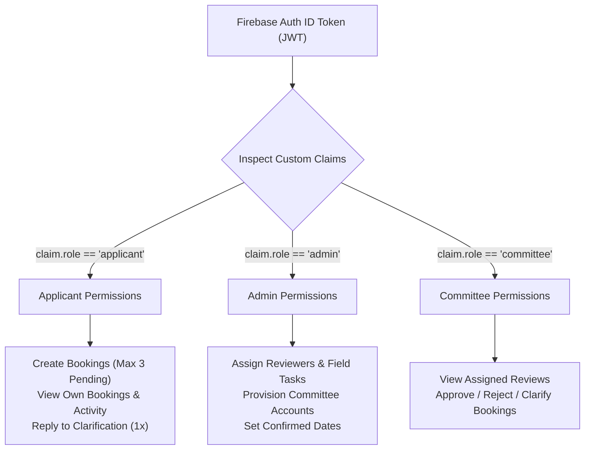
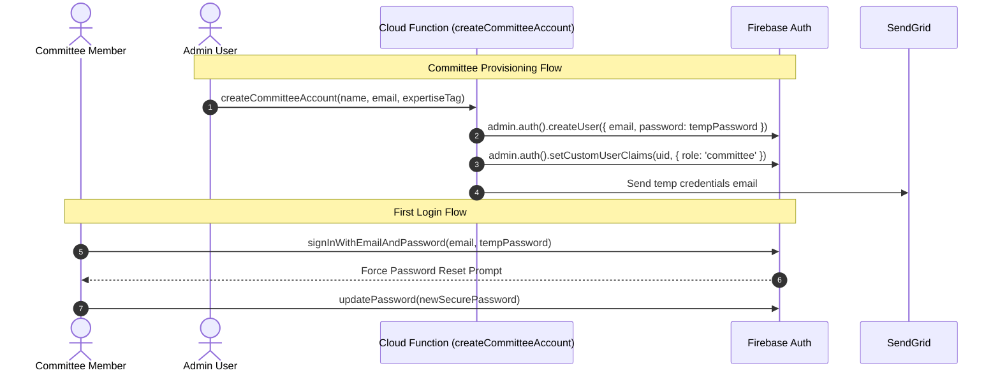
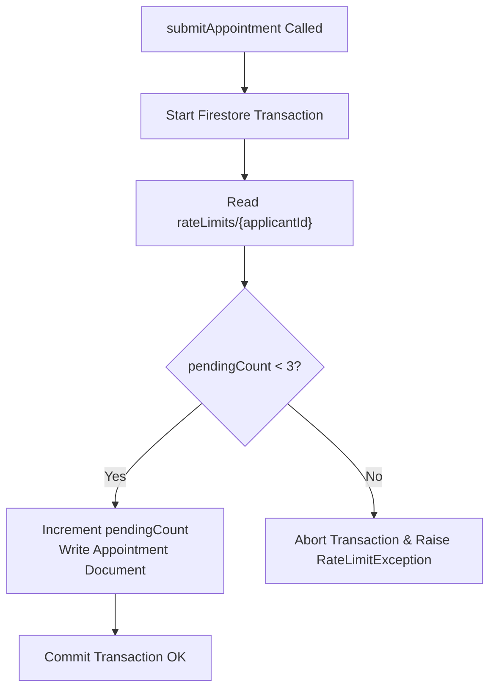

# 🔒 Authentication, Security & Authorization Rules

**Parent Index:** [brain.md](file:///d:/flutter%20projects/survey_booking_app/brain/brain.md)

---

## 1. Role-Based Access Control (RBAC) Architecture

Authentication relies on Firebase Auth paired with custom Auth claims set server-side via the Firebase Admin SDK:



> **SECURITY PRINCIPLE:** Client-side user document fields (`users/{uid}.role`) are NEVER trusted for security decisions. All Firestore and Storage Security Rules inspect `request.auth.token.role` exclusively.

---

## 2. Authentication & Provisioning Flows



---

## 3. Firestore Security Rules Strategy

```javascript
// Pseudocode / Strategy for firestore.rules
rules_version = '2';
service cloud.firestore {
  match /databases/{database}/documents {
    
    function isAuthenticated() {
      return request.auth != null && request.auth.token.email_verified == true;
    }
    
    function isRole(role) {
      return isAuthenticated() && request.auth.token.role == role;
    }

    match /users/{userId} {
      allow read: if isAuthenticated();
      allow write: if isRole('admin') || request.auth.uid == userId;
    }

    match /appointments/{appointmentId} {
      allow read: if isRole('admin') 
                  || (isRole('applicant') && resource.data.applicantId == request.auth.uid)
                  || (isRole('committee') && resource.data.assignedReviewerId == request.auth.uid);
      allow create: if isRole('applicant') && request.resource.data.applicantId == request.auth.uid;
      allow update: if isRole('admin') 
                   || (isRole('committee') && resource.data.assignedReviewerId == request.auth.uid)
                   || (isRole('applicant') && resource.data.applicantId == request.auth.uid && resource.data.status == 'clarification_requested');
      
      match /auditLog/{logId} {
        allow read: if isRole('admin') || resource.data.applicantId == request.auth.uid;
        allow write: if false; // Only Cloud Functions can write audit logs
      }
    }
  }
}
```

---

## 4. Rate-Limiting & Abuse Protection

To prevent spam submissions, applicants are restricted to a maximum of **3 unresolved appointments** (status `pending_assignment`, `under_review`, or `clarification_requested`):



> **RACE CONDITION GUARD:** The rate limit read and appointment creation write MUST occur inside the identical Firestore transaction. A separate read-then-write callable call introduces a race condition susceptible to parallel submission bypasses.

---

## 5. Security Evasion & Integrity Safeguards

- **Firebase App Check:** Integrated across Cloud Functions and Firestore via Play Integrity API to ensure incoming calls originate exclusively from genuine app builds.
- **File Validation:** Document/KML uploads are restricted client-side and verified server-side (PDF/JPG/PNG/KML/KMZ extensions, maximum 5MB per file).
- **PII Scrubbing:** All Crashlytics breadcrumbs and Analytics events are automatically sanitized to omit PII (XEN phone/email, applicant names, free-text replies).
