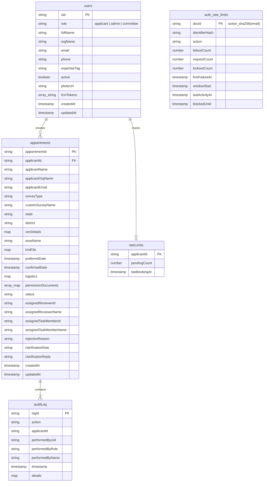

# ⚡ Backend Schema, Cloud Functions & API Contracts

**Parent Index:** [brain.md](file:///d:/flutter%20projects/survey_booking_app/brain/brain.md)

---

## 1. Cloud Firestore Database Schema



### Firestore Collection Reference Table

| Collection Path | Key Fields & Maps | Indexes & Constraints |
|---|---|---|
| `users/{uid}` | `role`, `fullName`, `email`, `phone`, `photoUrl`, `expertiseTag`, `active`, `fcmTokens[]` (max 10), `createdAt`, `updatedAt` | Keyed by Firebase Auth UID |
| `appointments/{id}` | `applicantId`, `surveyType`, `state`, `district`, `xenDetails` (`name`, `mobile`, `email`), `areaName`, `kmlFile` (`storagePath`, `originalFileName`, `fileType`, `sizeBytes`), `logistics` (`coordinatorName`, `coordinatorDesignation`, `driverName`, `driverMobile`, `vehicleNumber`, `vehicleModel`), `permissionDocuments[]`, `status`, `assignedReviewerId`, `assignedReviewerName`, `assignedTaskMemberId`, `assignedTaskMemberName`, `confirmedDate`, `createdAt`, `updatedAt` | Filtered by status, composite indexed for multi-role queries |
| `appointments/{id}/auditLog/{logId}` | `action`, `applicantId` (denormalized), `performedByUid`, `performedByRole`, `performedByName`, `timestamp` | Subcollection; queried via `collectionGroup('auditLog')` for applicants |
| `rateLimits/{applicantId}` | `pendingCount` (max 3), `lastBookingAt` | Written inside atomic submission transaction (appointment quota) |
| `auth_rate_limits/{docId}` | `identifierHash`, `action`, `failureCount`, `requestCount`, `lockoutCount`, `blockedUntil`, `lastActivityAt` | Keyed by `{action}_{sha256(email)}`. Managed exclusively by Cloud Functions Admin SDK. Rules: `allow read, write: if false;` |

---

## 2. Composite Indexes (`firestore.indexes.json`)

Required composite indexes for pagination and filtering across all 3 roles:
1. `appointments`: `status` (==), `createdAt` (desc) — Admin Dashboard status filter
2. `appointments`: `surveyType` (==), `status` (==), `createdAt` (desc) — Admin combined filter
3. `appointments`: `assignedReviewerId` (==), `createdAt` (desc) — Committee Reviews Dashboard queue
4. `appointments`: `assignedTaskMemberId` (==), `createdAt` (desc) — Committee Fieldwork Tasks Queue (Resolves PRD item)
5. `appointments`: `applicantId` (==), `createdAt` (desc) — Applicant My Bookings
6. `appointments`: `applicantId` (==), `status` (==), `createdAt` (desc) — Applicant My Bookings filtered by status
7. `appointments`: `applicantId` (==), `status` (`in` [`approved`, `task_assigned`]), `confirmedDate` (asc) — Home Upcoming Surveys
8. `auditLog` (`collectionGroup`): `applicantId` (==), `timestamp` (desc) — Home Recent Activity Feed

---

## 3. Firebase Storage Hierarchy

```
appointments/{appointmentId}/permissionDocuments/{uuid}_{originalFileName}
appointments/{appointmentId}/kml/{uuid}_{originalFileName}
users/{uid}/profile/{uuid}_{originalFileName}
```
- **Rules:** Access restricted to resource owner (applicant), Admins, and assigned committee members (verified via `isAssignedCommittee(appointmentId)`). Storage paths are stored in Firestore documents rather than public download URLs to prevent token leaks.

---

## 4. Callable Cloud Functions Contracts (Node.js 22 2nd Gen)

- **Administrative Functions:** Called through `AdminFunctionsService` (`lib/core/services/admin_functions_service.dart`), which performs local pre-flight admin claim validation, proactive session token refreshes (`getIdToken(true)`), and domain `Failure` mappings.
- **Unauthenticated Auth Functions:** Called through `AuthFunctionsService` (`lib/core/services/auth_functions_service.dart`), requiring no pre-flight auth checks, translating `resource-exhausted` into `AuthRateLimitFailure(message, secondsRemaining)`.

| Function Name | Invoker Role | Input Payload Parameters | Actions & Behavior | Configuration & IAM |
|---|---|---|---|---|
| `authenticateUser` | Public (Unauthenticated) | `{ email, password, requiredRole }` | Verifies credentials server-side via Google Identity Toolkit REST API (`signInWithPassword`). Enforces failure-based rate limiting in `/auth_rate_limits/` (Applicant: 5 failures/15m lock; Admin: 3 failures/30m lock). Verifies role and active status. **Returns:** `{ customToken, role, emailVerified }`. Client signs in with custom token. | `region: "us-central1"`, `cors: true`, `invoker: "public"`, `enforceAppCheck: false`, `secrets: [webApiKey]`. |
| `registerApplicant` | Public (Unauthenticated) | `{ fullName, email, phone, password, orgName }` | Enforces count-based rate limit (3 signups/email/hour). Creates Firebase Auth user via Admin SDK, sets custom claim `role: 'applicant'`, provisions Firestore `/users/{uid}`. **Returns:** `{ success: true, customToken, email }`. Client signs in with custom token to trigger email verification. | `region: "us-central1"`, `cors: true`, `invoker: "public"`, `enforceAppCheck: false`. |
| `requestPasswordReset` | Public (Unauthenticated) | `{ email }` | Enforces count-based rate limit (3 resets/email/hour). Dispatches Firebase-branded password reset email via Identity Toolkit REST API (`sendOobCode`). Silently succeeds on missing accounts to prevent user enumeration. **Returns:** `{ success: true, message }`. | `region: "us-central1"`, `cors: true`, `invoker: "public"`, `enforceAppCheck: false`, `secrets: [webApiKey]`. |
| `createCommitteeAccount` | Admin | `{ name, email, phone, expertiseTag }` | Invokes Firebase Admin SDK, provisions user (`emailVerified: true`), sets custom claim `role: 'committee'`, writes Firestore `/users/{uid}` with phone, generates password reset link. **Returns:** `{ success: true, uid, email, tempPassword, resetLink, message }`. Client viewmodel threads this response to present the credentials dialog. | `region: "us-central1"`, `cors: true`, `invoker: "public"`, `enforceAppCheck: false`. Service Account requires `Firebase Admin` / `Cloud Datastore User` role. |
| `submitAppointment` | Applicant | `{ surveyType, state, district, xenDetails, areaName, kmlFile, preferredDate, logistics, permissionDocuments }` | Executes inside atomic Firestore transaction: validates verified applicant, enforces 3-booking active quota (`pendingCount < 3`), increments `pendingCount`, writes appointment with initial status `pending_assignment`, writes initial auditLog entry. | `region: "us-central1"`, `cors: true`, `invoker: "public"`, `enforceAppCheck: false`. |
| `reviewAppointment` | Committee / Admin | `{ appointmentId, action: "approve" \| "reject" \| "clarify", reasonOrNote?: string }` | Enforces committee/admin RBAC and reviewer assignment (`assignedReviewerId == uid` unless admin). Requires current status `under_review`. Executes a strict two-phase Firestore transaction (Phase 1: all `txn.get` reads for appointment and `rateLimits/{applicantId}` quota; Phase 2: all `txn.update` / `txn.set` writes) ensuring adherence to Firestore invariants. Updates status, rejection/clarification fields, writes immutable `auditLog` entry, and on approval/rejection atomically decrements `rateLimits/{applicantId}.pendingCount` by 1. Enforces single-clarification limit. **Returns:** `{ success: true }`. | `region: "us-central1"`, `cors: true`, `invoker: "public"`, `enforceAppCheck: false`. |
| `submitClarificationReply` | Applicant | `{ appointmentId, reply }` | Enforces applicant ownership (`applicantId == uid`) and verified email. Requires current status `clarification_requested` and ensures no prior reply exists. Updates status back to `under_review`, records `clarificationReply` and `clarificationRepliedAt`, writes auditLog entry. **Returns:** `{ success: true, newStatus: "under_review" }`. | `region: "us-central1"`, `cors: true`, `invoker: "public"`, `enforceAppCheck: false`. |
| `assignReviewer` | Admin | `{ appointmentId, reviewerId, reviewerName }` | Admin-only callable. Validates appointment status is `pending_assignment`. Updates `assignedReviewerId`, `assignedReviewerName`, sets status to `under_review`, and writes auditLog entry. Protected by async `requireAdmin` guard with Firestore deactivation check, document role fallback, and custom claims backfill. **Returns:** `{ success: true }`. | `region: "us-central1"`, `cors: true`, `invoker: "public"`, `enforceAppCheck: false`. |
| `setConfirmedDate` | Admin | `{ appointmentId, confirmedDate }` | Admin-only callable. Updates `confirmedDate` timestamp on appointment and logs action to auditLog. Protected by async `requireAdmin` guard with Firestore deactivation check, document role fallback, and custom claims backfill. **Returns:** `{ success: true }`. | `region: "us-central1"`, `cors: true`, `invoker: "public"`, `enforceAppCheck: false`. |
| `assignFieldworkTask` | Admin | `{ appointmentId, memberId, memberName }` | Admin-only callable. Validates appointment is in `approved` status. Sets `assignedTaskMemberId`, `assignedTaskMemberName`, updates status to `task_assigned`, and logs to auditLog. Protected by async `requireAdmin` guard with Firestore deactivation check, document role fallback, and custom claims backfill. **Returns:** `{ success: true }`. | `region: "us-central1"`, `cors: true`, `invoker: "public"`, `enforceAppCheck: false`. |
| `updateProfilePhoto` | Any Role | `{ photoStoragePath }` | Updates `users/{uid}.photoUrl` in Firestore | Standard callable |

---

## 5. Firestore Event Triggers

- **`onAppointmentCreate`:** Triggers confirmation email to Applicant + fixed Institute BCC address.
- **`onStatusChange`:** Monitors `status` mutations and sends tailored push notifications via FCM and emails via SendGrid to involved roles.
- **`onAppointmentWrite`:** Automatically appends an `auditLog` subcollection entry detailing who changed what status and when.

---

## 6. Push Notification Dispatch Contracts (`functions/src/functions/notifications/`)

All appointment mutation Cloud Functions invoke `sendAppointmentNotification(type, appointmentData, appointmentId)` asynchronously before returning.

### Notification Matrix & Recipient Resolution

| Type Constant | Triggering Event | Target Recipient(s) | Title | Body Template |
|---|---|---|---|---|
| `booking_created` | `submitAppointment` | All active users with `role == 'admin'` in `/users/` | `New Booking Request` | `New booking #{id} from {applicantName} for {surveyType}` |
| `reviewer_assigned` | `assignReviewer` | `appointment.applicantId` | `Reviewer Assigned` | `A committee reviewer has been assigned to survey #{id}` |
| `clarification_requested` | `reviewAppointment` (action: clarify) | `appointment.applicantId` | `Clarification Needed` | `The committee has requested clarification for survey #{id}` |
| `clarification_replied` | `submitClarificationReply` | `appointment.assignedReviewerId` | `Clarification Replied` | `{applicantName} submitted a reply for survey #{id}` |
| `booking_approved` | `reviewAppointment` (action: approve) | `appointment.applicantId` | `Survey Approved` | `Your survey #{id} has been approved` |
| `booking_rejected` | `reviewAppointment` (action: reject) | `appointment.applicantId` | `Survey Update` | `Your survey #{id} status has been updated` |
| `task_assigned` | `assignFieldworkTask` | `appointment.assignedTaskMemberId` | `Task Assigned` | `You have been assigned to fieldwork task for survey #{id}` |

### FCM Payload Structure:
```json
{
  "notification": {
    "title": "...",
    "body": "..."
  },
  "data": {
    "type": "booking_created | reviewer_assigned | ...",
    "appointmentId": "<id>",
    "click_action": "FLUTTER_NOTIFICATION_CLICK"
  },
  "android": {
    "priority": "high",
    "notification": {
      "channelId": "survey_desk_notifications"
    }
  }
}
```

### Multicast & Stale Token Pruning:
- Dispatched via `admin.messaging().sendEachForMulticast()`.
- Error codes `messaging/registration-token-not-registered` and `messaging/invalid-registration-token` trigger automatic execution of `pruneInvalidToken(uid, token)`, removing the stale token from `users/{uid}.fcmTokens` via `FieldValue.arrayRemove`.
- All notification exceptions are caught and logged without breaking business transactions or propagating failures to callers.

