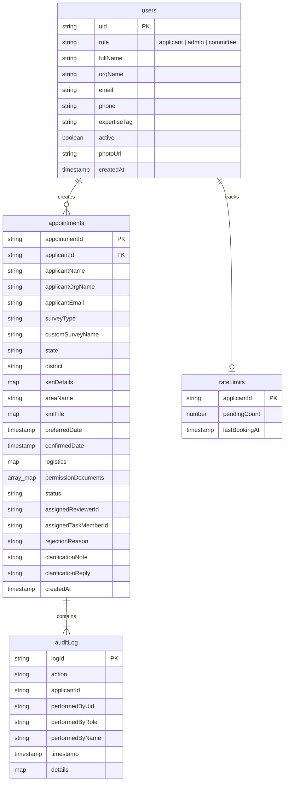

# ⚡ Backend Schema, Cloud Functions & API Contracts

**Parent Index:** [brain.md](file:///d:/flutter%20projects/survey_booking_app/brain/brain.md)

---

## 1. Cloud Firestore Database Schema



### Firestore Collection Reference Table

| Collection Path | Key Fields & Maps | Indexes & Constraints |
|---|---|---|
| `users/{uid}` | `role`, `fullName`, `email`, `phone`, `photoUrl`, `active` | Keyed by Firebase Auth UID |
| `appointments/{id}` | `applicantId`, `surveyType`, `state`, `district`, `xenDetails` (`name`, `mobile`, `email`), `areaName`, `kmlFile` (`storagePath`, `originalFileName`, `fileType`, `sizeBytes`), `logistics` (`coordinatorName`, `coordinatorDesignation`, `driverName`, `driverMobile`, `vehicleNumber`, `vehicleModel`), `permissionDocuments[]`, `status`, `assignedReviewerId`, `assignedTaskMemberId`, `confirmedDate` | Filtered by status, composite indexed for role queries |
| `appointments/{id}/auditLog/{logId}` | `action`, `applicantId` (denormalized), `performedByUid`, `performedByRole`, `performedByName`, `timestamp` | Subcollection; queried via `collectionGroup('auditLog')` |
| `rateLimits/{applicantId}` | `pendingCount` (max 3), `lastBookingAt` | Written inside atomic submission transaction |

---

## 2. Composite Indexes (`firestore.indexes.json`)

Required composite indexes for pagination and filtering:
1. `appointments`: `status` (==), `createdAt` (desc) — Admin Dashboard status filter
2. `appointments`: `surveyType` (==), `status` (==), `createdAt` (desc) — Admin combined filter
3. `appointments`: `assignedReviewerId` (==), `status` (==), `createdAt` (desc) — Committee Dashboard
4. `appointments`: `applicantId` (==), `createdAt` (desc) — Applicant My Bookings
5. `appointments`: `applicantId` (==), `status` (`in` [`approved`, `task_assigned`]), `confirmedDate` (asc) — Home Upcoming Surveys
6. `auditLog` (`collectionGroup`): `applicantId` (==), `timestamp` (desc) — Home Recent Activity Feed

---

## 3. Firebase Storage Hierarchy

```
appointments/{appointmentId}/permissionDocuments/{uuid}_{originalFileName}
appointments/{appointmentId}/kml/{uuid}_{originalFileName}
users/{uid}/profile/{uuid}_{originalFileName}
```
- **Rules:** Access restricted to resource owner (applicant), Admins, and assigned committee reviewer. Storage paths are stored in Firestore documents rather than public download URLs to prevent token leaks.

---

## 4. Callable Cloud Functions Contracts (Node.js 20 2nd Gen)

| Function Name | Invoker Role | Input Payload Parameters | Actions & Behavior |
|---|---|---|---|
| `createCommitteeAccount` | Admin | `{ name, email, expertiseTag }` | Invokes Firebase Admin SDK, provisions user, sets custom claim `committee: true`, emails temp password |
| `submitAppointment` | Applicant | `{ surveyType, state, district, xenDetails, areaName, kmlFile, preferredDate, logistics, permissionDocuments }` | Executes inside Firestore transaction: runs `checkRateLimit`, creates `appointments/{id}` with status `pending_assignment` |
| `assignReviewer` | Admin | `{ appointmentId, committeeMemberId }` | Validates appointment state, updates `assignedReviewerId`, changes status to `under_review` |
| `setConfirmedDate` | Admin | `{ appointmentId, confirmedDate }` | Updates `confirmedDate` timestamp on approved/assigned appointment |
| `reviewAppointment` | Committee | `{ appointmentId, action: "approve" \| "reject" \| "clarify", reasonOrNote }` | Mutates status (`approved` / `rejected` / `clarification_requested`), updates rejection/clarification fields |
| `submitClarificationReply` | Applicant | `{ appointmentId, replyText }` | Validates single-reply rule, writes `clarificationReply`, resets status to `under_review` |
| `assignFieldworkTask` | Admin | `{ appointmentId, committeeMemberId }` | Sets `assignedTaskMemberId`, changes status to `task_assigned` |
| `updateProfilePhoto` | Admin | `{ photoStoragePath }` | Updates `users/{uid}.photoUrl` in Firestore |

---

## 5. Firestore Event Triggers

- **`onAppointmentCreate`:** Triggers confirmation email to Applicant + fixed Institute BCC address.
- **`onStatusChange`:** Monitors `status` mutations and sends tailored push notifications via FCM and emails via SendGrid to involved roles.
- **`onAppointmentWrite`:** Automatically appends an `auditLog` subcollection entry detailing who changed what status and when.
