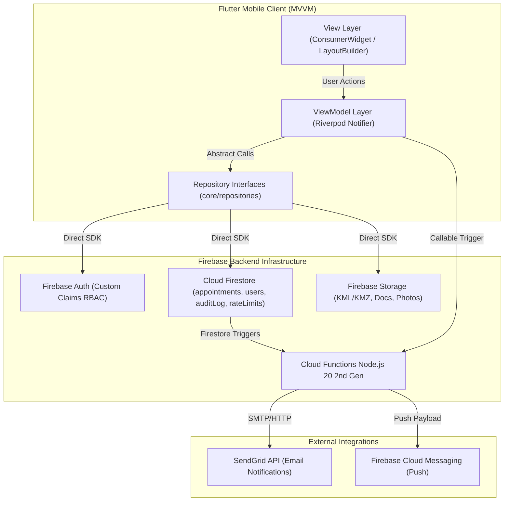

# 🧠 Project Knowledge Base (Brain Master Index)

**Project:** Survey Desk (`survey_booking_app` / `survey_desk`)  
**Stack:** Flutter 3.x (Dart) + Firebase (Auth, Firestore, Storage, Cloud Functions Node.js 20 2nd Gen, Cloud Messaging)  
**Architecture:** 3-Layer MVVM + Feature-First Modularity + SOLID Principles  
**Target Roles:** Applicant, Admin, Committee Member  

---

## 📌 Master Knowledge Index

| Module / Topic | Description | File Link |
|---|---|---|
| **Architecture & Data Flow** | 3-layer MVVM, feature-first boundary rules, data flow, and request lifecycle | [architecture.md](file:///d:/flutter%20projects/survey_booking_app/brain/architecture.md) |
| **Directory & Codebase Map** | Complete workspace directory structure, file responsibilities, and target blueprint | [directory_map.md](file:///d:/flutter%20projects/survey_booking_app/brain/directory_map.md) |
| **Frontend & UI System** | 23 screen inventory, 9-step wizard state, M3 Sage & Stone theme system, `go_router` setup | [modules_frontend.md](file:///d:/flutter%20projects/survey_booking_app/brain/modules_frontend.md) |
| **Backend Schema & APIs** | Firestore schema, composite indexes, Storage paths, and 9 Callable Cloud Functions | [backend_api.md](file:///d:/flutter%20projects/survey_booking_app/brain/backend_api.md) |
| **Auth & Security** | Email/pass Auth, custom claims RBAC, Firestore/Storage security rules, rate-limiting transaction | [auth_security.md](file:///d:/flutter%20projects/survey_booking_app/brain/auth_security.md) |
| **Business Logic & Workflows** | 6-state appointment lifecycle, committee review loop, clarification roundtrip, audit log feed | [workflows_business_logic.md](file:///d:/flutter%20projects/survey_booking_app/brain/workflows_business_logic.md) |
| **Integrations & Deployment** | SendGrid email, FCM push, Firebase App Check, Android release & Play Console pipeline | [integrations_deployment.md](file:///d:/flutter%20projects/survey_booking_app/brain/integrations_deployment.md) |
| **Testing, Quality & Monitoring** | Crashlytics breadcrumbs (PII-safe), Performance traces, Analytics, coding conventions | [testing_quality_monitoring.md](file:///d:/flutter%20projects/survey_booking_app/brain/testing_quality_monitoring.md) |

---

## 📐 System Topology & Core Flow

---

## ⚡ Quick Project Context Summary

- **Core Function:** Replaces manual survey appointment bookings with a digital 9-step wizard workflow spanning Applicants, Admins, and Review Committee Members.
- **Current Development Baseline:** Core layout skeleton (`lib/responsive/`), theme tokens (`lib/core/theme/app_theme.dart`), spacing/radii (`lib/core/constants/app_spacing.dart`), and Firebase config (`lib/firebase_options.dart`) are initialized. Target technical specification fully defined in `docs/`.
- **State Engine:** Single Riverpod `BookingWizardViewModel` holds accumulated state across wizard steps 1–7; single atomic backend transaction executes submission at step 8.
