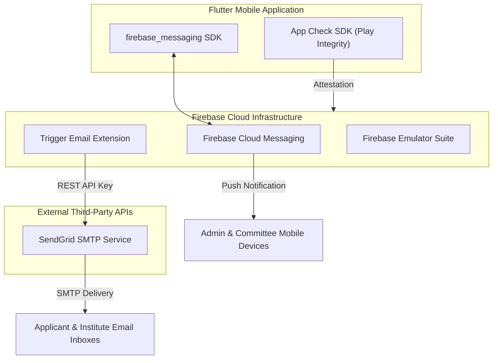
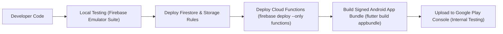

# 🚀 Integrations, Deployment & Infrastructure Pipeline

**Parent Index:** [brain.md](file:///d:/flutter%20projects/survey_booking_app/brain/brain.md)

---

## 1. External Services & Integrations Architecture



### Integration Details

| Integration | Purpose | Configuration & Tokens |
|---|---|---|
| **SendGrid SMTP** | Transactional emails (confirmations, rejections, approvals) | Wired via Firebase "Trigger Email" Extension using `SENDGRID_API_KEY` |
| **Firebase Cloud Messaging** | Real-time push notifications for Admins & Committee Members | Handled natively via `firebase_messaging` & APNs/FCM tokens |
| **Firebase App Check** | Attests application integrity, blocking unauthenticated API access | Play Integrity API (Android), reCAPTCHA (Web readiness) |
| **Static Reference Data** | States & Districts cascading lookup | Bundled JSON asset `assets/india_states_districts.json` |

---

## 2. Environment Variables & Secret Configuration

Secrets and configuration properties must be set in Firebase Cloud Functions environment variables / Secret Manager:

```bash
# Cloud Functions Environment Variables
SENDGRID_API_KEY="SG.xxxxxxxxxxxxxxxxxxxxxx"
INSTITUTE_NOTIFY_EMAIL="notifications@surveyinstitute.gov.in"
FIREBASE_PROJECT_ID="surveybookingapp"
```

---

## 3. Build & Deployment Strategy



### Platform Strategy
- **Android Target:** Android-first build pipeline (`flutter build appbundle --release`). Play Console Internal Testing distribution ($25 one-time developer registration).
- **iOS Target:** iOS build deferred pending Apple Developer Account registration. Architecture and dependencies (e.g., `pdfx`, `image_picker`) remain iOS-compatible.
- **Local Emulation:** Local development runs against Firebase Emulator Suite (`firebase emulators:start`) covering Auth, Firestore, Storage, and Cloud Functions.
