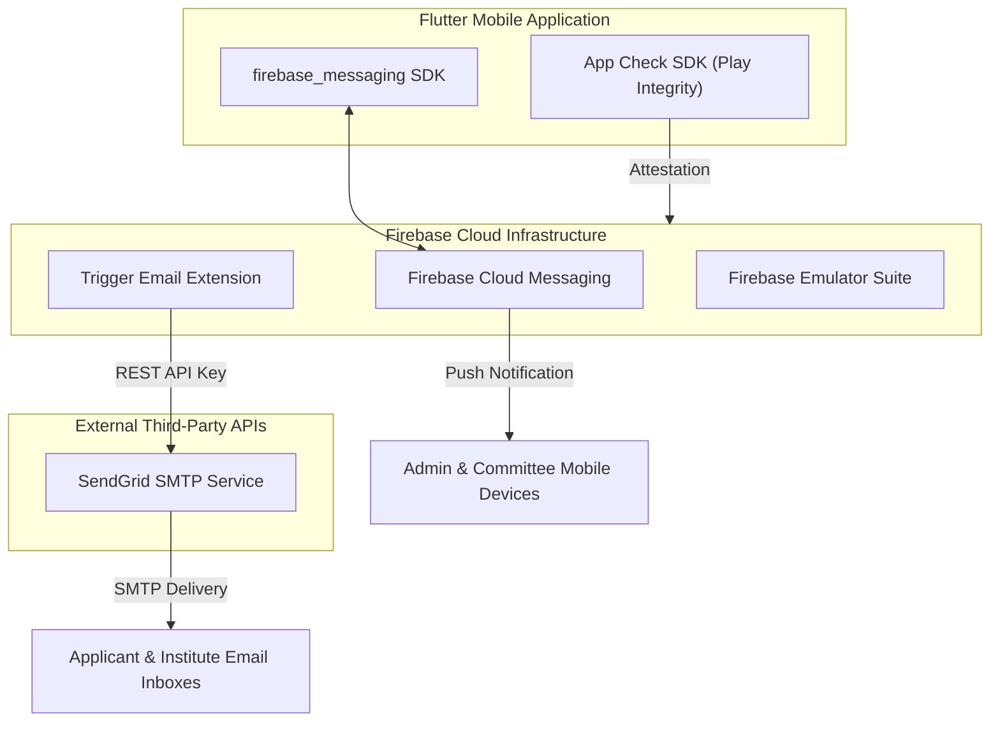
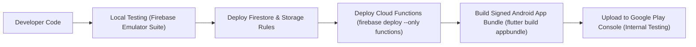
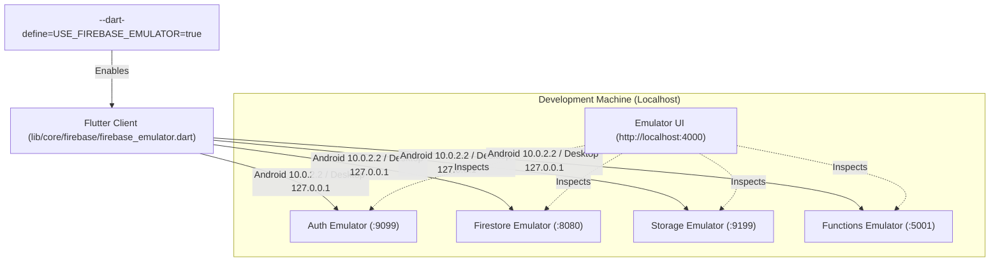

# 🚀 Integrations, Deployment & Infrastructure Pipeline

**Parent Index:** [brain.md](file:///d:/flutter%20projects/survey_booking_app/brain/brain.md)

---

## 1. External Services & Integrations Architecture



### Integration Details

| Integration | Purpose | Configuration & Tokens |
|---|---|---|
| **SendGrid SMTP** | Transactional emails (confirmations, rejections, approvals) | Wired via Firebase "Trigger Email" Extension using `SENDGRID_API_KEY` |
| **Firebase Cloud Messaging** | Real-time push notifications across all roles (7 notification types) | Handled natively via `firebase_messaging` & APNs/FCM tokens |
| **Firebase App Check** | Attests application integrity, blocking unauthenticated API access | Play Integrity API (Android), reCAPTCHA (Web readiness) |
| **Static Reference Data** | States & Districts cascading lookup | Bundled JSON asset `assets/india_states_districts.json` |

---

### 1.1 Firebase Cloud Messaging (FCM) Push Pipeline

The app employs a server-dispatched FCM notification model:
1. **Token Ingestion & Retention:**
   - Client fetches device FCM token on startup/login and stores it into `users/{uid}.fcmTokens` via `FieldValue.arrayUnion([token])`.
   - On logout or user switch, the token is pruned via `FieldValue.arrayRemove([token])`.
   - Token refresh events (`onTokenRefresh`) stream new tokens to Firestore seamlessly.
   - `firestore.rules` enforces array size limits (`<= 10`) to prevent storage exhaustion attacks.
2. **Server-Side Dispatch (Cloud Functions Gen 2):**
   - Mutation callables invoke `sendAppointmentNotification(type, appointmentData, appointmentId)`.
   - Recipients resolved dynamically: `booking_created` queries all active admin users; other events resolve `applicantId`, `assignedReviewerId`, or `assignedTaskMemberId`.
   - Dispatches multicast via `admin.messaging().sendEachForMulticast(message)`.
   - Stale or invalid tokens (`messaging/registration-token-not-registered`, `messaging/invalid-registration-token`) trigger automated background pruning (`pruneInvalidToken()`).
3. **Client Lifecycle & Deep Linking:**
   - **Foreground:** Bypasses native system tray; caught by `FirebaseMessaging.onMessage` and rendered via `NotificationOverlayWrapper` & `NotificationOverlay` with animated entry and 4s auto-dismiss.
   - **Background & Terminated:** Tapping native system notification triggers `NotificationHandler`. Deep linking is routed via `NotificationNavigation` strictly after authentication and role verification settle (`authViewModelProvider.value != null`), navigating directly to the affected appointment detail view.


---

## 2. Environment Variables & Secret Configuration

Secrets and configuration properties must be set in Firebase Cloud Functions environment variables / Secret Manager:

```bash
# Cloud Functions Secret Manager (Required for Server-Mediated Auth Rate Limiting)
firebase functions:secrets:set AUTH_WEB_API_KEY
# Paste the Web API Key from Firebase Console -> Project Settings -> General -> Web API Key

# Cloud Functions Environment Variables
SENDGRID_API_KEY="SG.xxxxxxxxxxxxxxxxxxxxxx"
INSTITUTE_NOTIFY_EMAIL="notifications@surveyinstitute.gov.in"
FIREBASE_PROJECT_ID="surveybookingapp"
```

> **Secret Naming Rule (Firebase CLI Reserved Prefixes):** The Firebase CLI strictly rejects secret names beginning with `FIREBASE_`, `X_GOOGLE_`, or `EXT_` (e.g., `FIREBASE_WEB_API_KEY` will fail with `Error: Invalid secret key: starts with a reserved prefix`). Use `AUTH_WEB_API_KEY`.

> **Why `AUTH_WEB_API_KEY` is required:** The Firebase Admin SDK has no `verifyPassword()` method. To enforce rate limiting on the server prior to session establishment, the `authenticateUser` and `requestPasswordReset` 2nd Gen Cloud Functions query the Google Identity Toolkit REST API (`/accounts:signInWithPassword` and `/accounts:sendOobCode`) directly from Node.js, which requires the project's Web API Key.

---

## 3. Build & Deployment Strategy



### Platform Strategy
- **Android Target:** Android-first build pipeline (`flutter build appbundle --release`). Play Console Internal Testing distribution ($25 one-time developer registration).
- **iOS Target:** iOS build deferred pending Apple Developer Account registration. Architecture and dependencies (e.g., `pdfx`, `image_picker`) remain iOS-compatible.
- **Local Emulation:** Local development runs against Firebase Emulator Suite (`firebase emulators:start`) covering Auth, Firestore, Storage, and Cloud Functions.

---

### 3.1 Firebase Local Emulator Suite Architecture & Developer Workflow

To enable rapid offline feature development and protect production Firestore data and Auth user pools from corruption, the project includes a dedicated local emulation pipeline.



#### Port Topology (`firebase.json`):
- **Auth Emulator:** `9099`
- **Firestore Emulator:** `8080`
- **Storage Emulator:** `9199`
- **Cloud Functions Emulator:** `5001`
- **Emulator UI:** `4000` (Web dashboard at `http://localhost:4000`)

#### Production-Safe Toggle (`lib/core/firebase/firebase_emulator.dart`):
```dart
const bool kUseFirebaseEmulator =
    bool.fromEnvironment('USE_FIREBASE_EMULATOR', defaultValue: false);
```
- **Zero Production Risk:** The default value is strictly `false`. Normal release builds (`flutter build apk`, `flutter build appbundle`) will never connect to an emulator even if accidentally run on a debug device.
- **Host Resolution:** Android Virtual Devices (AVD) require routing through `10.0.2.2` to access host loopback services. Desktop, Web, and iOS resolve to `127.0.0.1`.
- **Firestore Persistence Disabled:** `FirebaseFirestore.instance.settings = const Settings(persistenceEnabled: false);` ensures local IndexedDB/disk cache does not pollute runs across emulator restarts.
- **App Check Conditional Bypass:** In `main.dart`, App Check (`FirebaseAppCheckSetup.initialize()`) is explicitly bypassed when `kUseFirebaseEmulator` is active, avoiding attestation failure crashes on local mock calls while enforcing App Check in production.

#### Developer Workflow Commands:
```bash
# 1. Start the entire emulator suite
firebase emulators:start

# 2. Run Flutter app targeting local emulators (Android Emulator)
flutter run -d emulator-5554 --dart-define=USE_FIREBASE_EMULATOR=true

# 3. Run Flutter connectivity integration test
flutter test test/integration/firebase_emulator_test.dart --dart-define=USE_FIREBASE_EMULATOR=true

# 4. Run automated rules unit test suite
cd firebase/tests && npm test
```


---

## 4. Known Deployment Pitfalls & Infrastructure Troubleshooting

### 4.1 Firebase Functions Deploy `ENOENT` Predeploy Error (Windows)
When running `firebase deploy --only functions` on Windows, you may encounter a stack trace ending with:
`Error: spawn npm --prefix "%RESOURCE_DIR%" run lint ENOENT`
`Error: functions predeploy error: Command terminated with non-zero exit code 1`

**Root Cause:**
This is a misleading error from `cross-spawn` on Windows. The predeploy hook in `firebase.json` runs `npm --prefix "$RESOURCE_DIR" run lint`. When `npm run lint` exits with a non-zero exit code (1) due to formatting/lint errors, `cross-spawn` fails to resolve `%RESOURCE_DIR%` in its failure handler, emitting the misleading `ENOENT`.

**Resolution & Project Linter Standard:**
1. The project's `functions/.eslintrc.js` specifies:
   - **4-space indentation** (`"indent": ["error", 4]`).
   - **Double quotes** (`"quotes": ["error", "double"]`).
   - **Deprecated JSDoc checks disabled** (`"require-jsdoc": 0`, `"valid-jsdoc": 0`).
   - **Max line length 120** (`"max-len": ["error", {"code": 120, "ignoreComments": true}]`).
2. Automatically format code to match these rules by running from the `functions` directory:
   ```bash
   cd functions
   npx eslint --fix src/
   ```
3. Test that both predeploy scripts succeed locally before deploying:
   ```bash
   npm run lint   # Must exit with code 0 (0 problems)
   npm run build  # Must compile TypeScript cleanly (tsc)
   ```

---

### 4.2 Cloud Run 2nd Gen "Unable to set the invoker" & IAM Proxy Error

When deploying 2nd Gen Cloud Functions (`authenticateUser`, `registerApplicant`, `requestPasswordReset`, `createCommitteeAccount`) or invoking them from the mobile app, you may encounter:
- During deployment: `Failed to set the IAM Policy on the Service ... Unable to set the invoker for the IAM policy ...`
- During mobile invocation: `AuthFailure('You must be logged in to perform this action.')` or HTTP `401 Unauthorized`.

**Architectural Rationale: Why Public Invocation is Required:**
1. **Google Cloud Run Corporate IAM vs Mobile App Users:** Firebase Functions 2nd Gen are deployed as Google Cloud Run services. Cloud Run's native IAM layer expects a Google Cloud Corporate IAM OIDC token (e.g. from an employee `@sensrs.com` account or a GCP service account).
2. **Unauthenticated Public Clients:** When a mobile user opens the app to **Log In**, **Sign Up**, or **Reset Password**, they do not possess a corporate Google Cloud IAM account. If Cloud Run is set to "Require Authentication", Cloud Run's outer gateway intercepts the request and returns an HTTP `401 Unauthorized` before the request can reach the Node.js function.
3. **Security Model (Network Reachability $\neq$ Authorization):** Setting `invoker: "public"` (`allUsers` $\rightarrow$ `roles/run.invoker`) only allows HTTP packets to reach the container. The application code strictly protects itself:
   - `authenticateUser` verifies email/password via Identity Toolkit REST API, verifies active status in Firestore, enforces atomic rate-limiting progressive lockouts (15–30m), and checks user role before minting custom tokens.
   - `registerApplicant` enforces count-based rate limits (max 3/hour per email) and hardcodes the role claim strictly to `'applicant'`.
   - `requestPasswordReset` enforces max 3 resets/hour and prevents email enumeration.
   - `createCommitteeAccount` checks `request.auth` and verifies `request.auth.token.role == 'admin'`, instantly denying unauthorized callers.
   - Firebase App Check (Google Play Integrity) prevents raw bot scripts from invoking the endpoints.

**Deployment Fix (When Blocked by "Domain Restricted Sharing"):**
In Google Cloud Organizations (e.g. `@sensrs.com`), the organization policy `constraints/iam.allowedPolicyMemberDomains` blocks automated CLI assignment of `allUsers`. Resolve using either method:

* **Method 1: Allow Unauthenticated on Services in Cloud Run Console (Fastest)**:
  1. Open [Google Cloud Run Console](https://console.cloud.google.com/run?project=surveybookingapp).
  2. For each service (`authenticateuser`, `registerapplicant`, `requestpasswordreset`):
     - Click the service -> **Security** tab -> Select **"Allow unauthenticated invocations"** -> **Save**.
* **Method 2: Override Organization Policy at Project Level**:
  1. Open [IAM & Admin -> Organization Policies](https://console.cloud.google.com/iam-admin/orgpolicies/iam-allowedPolicyMemberDomains?project=surveybookingapp).
  2. Select **Domain restricted sharing** (`constraints/iam.allowedPolicyMemberDomains`) -> **Manage Policy**.
  3. Select **Override parent's policy** -> Rules: **Allow All** (or toggle Enforcement to **Off**) -> **Save**.
  4. Re-run `firebase deploy --only functions`.

---

### 4.3 Cloud Functions Compute Engine Service Account Permissions (`7 PERMISSION_DENIED`)
When a 2nd Gen Cloud Function attempts to read/write Firestore or create Firebase Auth users via `firebase-admin`, it fails with `Unhandled error Error: 7 PERMISSION_DENIED: Missing or insufficient permissions.`, surfacing in the client as a network/server timeout.

**Root Cause:**
Cloud Functions 2nd Gen execute under the default Compute Engine Service Account (`<project-number>-compute@developer.gserviceaccount.com`). If this service account has its default `Editor` role removed (a common GCP security hardening practice), `admin.firestore()` and `admin.auth()` calls are denied by IAM.

**Resolution:**
1. Open [Google Cloud IAM & Admin](https://console.cloud.google.com/iam-admin/iam).
2. Locate `<project-number>-compute@developer.gserviceaccount.com`.
3. Click the **Edit (Pencil)** icon -> Click **Add Another Role**.
4. Assign the **Firebase Admin** role (or **Cloud Datastore User** + **Service Usage Consumer**).
5. Save changes and wait 1–2 minutes for IAM propagation.

---

### 4.4 `auth.createCustomToken()` Silently Fails → "Login Failed: Internal" (Gen 2 Functions)

**Symptom:**
Admin or applicant login returns `Login Failed: Internal` in the Flutter UI. Firebase Function logs show:
```
FirebaseAuthError: Permission 'iam.serviceAccounts.signBlob' denied on resource (or it may not exist).
code: 'auth/insufficient-permission'
```

**Root Cause:**
`auth.createCustomToken(uid)` (used by `authenticateUser` to mint a Firebase session token) requires the executing service account to have the `iam.serviceAccounts.signBlob` permission. In **Gen 1 Functions**, the **App Engine default service account** receives this permission automatically. In **Gen 2 Functions** (Cloud Run), the **Compute Engine default service account** is used instead — and Google does **NOT** grant `signBlob` to it by default.

| | Gen 1 Functions | Gen 2 Functions (Cloud Run) |
|---|---|---|
| Service Account | App Engine default SA | Compute Engine default SA |
| `signBlob` pre-granted | ✅ Yes | ❌ No — must be granted |
| `createCustomToken()` OOB | ✅ Works | ❌ Fails with `auth/insufficient-permission` |

**Resolution (No redeploy required):**
1. Open [IAM & Admin → IAM](https://console.cloud.google.com/iam-admin/iam?project=surveybookingapp).
2. Find `458361446708-compute@developer.gserviceaccount.com`.
3. Click the **Edit (pencil)** icon.
4. Click **+ ADD ANOTHER ROLE** → search for **`Service Account Token Creator`** → select it.
5. Click **Save**. IAM changes propagate in approximately **60 seconds** — no function redeploy is needed.

> **Note:** This grants the service account the right to sign tokens on *behalf of itself* — a narrow, scoped grant. The account already holds `Firebase Admin` for Firestore/Auth access; this is an addendum specifically for the `signBlob` cryptographic operation used in custom token minting.

---

### 4.5 Firestore Transaction "All Reads Before All Writes" Rule & `reviewAppointment` Internal Error

**Symptom:**
When a committee member taps **Approve** in `CommitteeReviewDetailScreen`, the confirmation modal completes, but the action fails with:
`Approve failed: Internal error` (`FirebaseFunctionsException(code: 'internal')`).

**Root Cause:**
Google Cloud Firestore strictly enforces across all SDKs:
> *All transaction reads (`txn.get()`) must be executed before all transaction writes (`txn.update()`, `txn.set()`, `txn.delete()`).*

In `functions/src/functions/appointments/review_appointment.ts`, the code originally performed:
1. `txn.update(appointmentRef, updates);` (Write operation)
2. `const rateLimitSnap = await txn.get(rateLimitRef);` (Read operation inside the quota restoration block)

When approving or rejecting, calling `txn.get(rateLimitRef)` after `txn.update(appointmentRef, ...)` triggered an uncaught runtime error: `Error: Firestore transactions require all reads to be executed before all writes`, which Firebase Functions 2nd Gen wrapped as HTTP 500 / `status: INTERNAL`.

**Resolution:**
1. Structure transaction bodies into two explicit phases:
   - **Phase 1 (All Reads)**: Read both `appointmentRef` and `rateLimitRef` (if `action === "approve" || action === "reject"`), and perform all validation guards.
   - **Phase 2 (All Writes)**: Call `txn.update(appointmentRef, updates)`, `txn.set(rateLimitRef, ...)`, and `txn.set(auditRef, ...)`.
2. Target the single function during deployment to avoid artifact collisions:
   ```bash
   firebase deploy --only functions:reviewAppointment
   ```
3. If deployment fails with `Authentication Error: Your credentials are no longer valid`, run:
   ```bash
   firebase login --reauth
   ```

