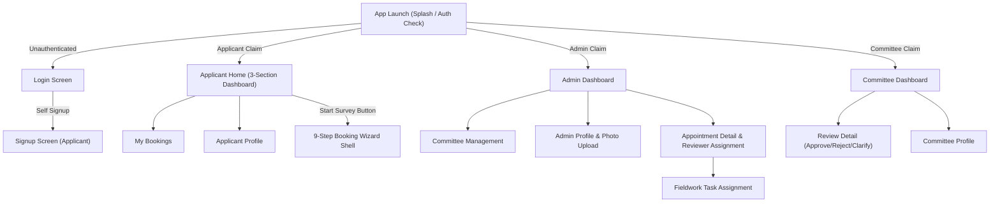
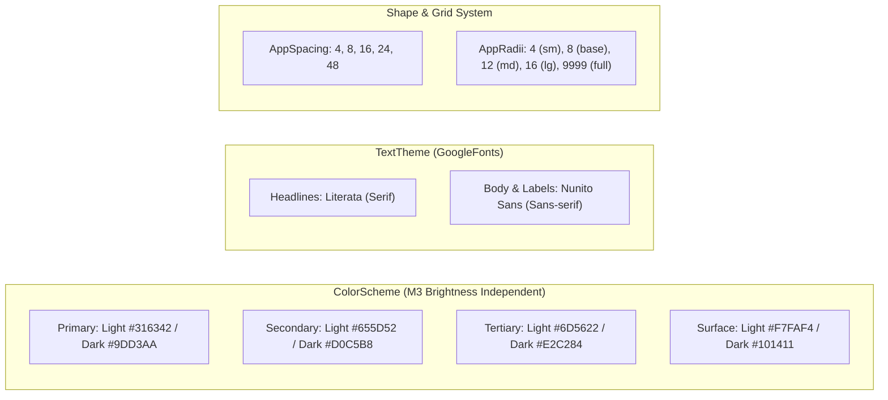

# 🎨 Frontend Architecture, Screens & State Management

**Parent Index:** [brain.md](file:///d:/flutter%20projects/survey_booking_app/brain/brain.md)

---

## 1. 23 Screen Inventory & Routing Map

The application consists of 23 distinct screens categorized across 3 roles:



### Detailed Screen Catalog

| Role | Screen Name | Key Components & Function |
|---|---|---|
| **Shared** | `1. Splash / Auth Check` | Resolves Firebase session & custom claims, routes to Home/Login |
| **Shared** | `2. Login` | Email/password, forgot password trigger, unverified email block |
| **Shared** | `3. Signup` | Applicant registration with phone/email validation |
| **Applicant Core** | `4. Home` | Upcoming Scheduled Surveys, Recent Requests, Activity Feed |
| **Applicant Core** | `5. My Bookings` | Paginated 20/page list filterable by status |
| **Applicant Core** | `6. Appointment Detail` | Read-only details + clarification reply textfield |
| **Applicant Core** | `7. Profile` | Name, organization, email, phone edit |
| **Wizard (1–9)** | `8. Step 1: Survey Type` | Single-select (Socio Economic, Benchmarking, DGPS, Bathymetry, Other) |
| **Wizard (1–9)** | `9. Step 2: State & District` | Cascading dropdowns backed by static JSON reference asset |
| **Wizard (1–9)** | `10. Step 3: XEN Details` | Executive Engineer Name, 10-digit Mobile, Email |
| **Wizard (1–9)** | `11. Step 4: Area & KML` | Area Name (max 150 chars) + single KML/KMZ upload |
| **Wizard (1–9)** | `12. Step 5: Start Date` | DatePicker (Saturdays/Sundays disabled, min +1 day, max +90 days) |
| **Wizard (1–9)** | `13. Step 6: Logistics` | Coordinator Name & Title, Driver Name & Mobile, Vehicle Num & Model |
| **Wizard (1–9)** | `14. Step 7: Permissions` | Document upload (1 to 5 files, PDF/JPG/PNG, max 5MB each) |
| **Wizard (1–9)** | `15. Step 8: Review & Confirm` | Read-only aggregated summary, inline edit jump links, single submit CTA |
| **Wizard (1–9)** | `16. Step 9: Acknowledgement` | Reference ID confirmation screen, "Done" returns Home |
| **Admin** | `17. Admin Dashboard` | Filterable status list with denormalized applicant names |
| **Admin** | `18. Admin Detail` | Full inspection + `assignReviewer` & `setConfirmedDate` controls |
| **Admin** | `19. Committee Mgmt` | Provision new committee members via Cloud Function |
| **Admin** | `20. Task Assignment` | Post-approval fieldwork assignment dropdown |
| **Admin** | `21. Admin Profile` | Admin contact details + `updateProfilePhoto` upload |
| **Committee** | `22. Committee Dash` | Paginated list of assigned review tasks |
| **Committee** | `23. Review Detail` | Inspection + Approve / Reject (reason) / Request Clarification (note) |

---

## 2. 9-Step Booking Wizard State Engine

State across steps 1–7 is accumulated locally in a single Riverpod `Notifier` without invoking any backend writes until step 8:

```dart
// Conceptual State Structure (BookingWizardViewModel)
class BookingWizardState {
  final int currentStep;
  final SurveyType? surveyType;
  final String? customSurveyName;
  final String? state;
  final String? district;
  final XenDetails? xenDetails;
  final String? areaName;
  final KmlFile? stagedKmlFile;
  final DateTime? preferredDate;
  final Logistics? logistics;
  final List<PermissionDocument> stagedPermissionDocs;
  final bool isSubmitting;
  final String? errorMessage;
  // ... getters verifying step validation rules ...
}
```

- **Validation:** Each step's "Next" button is enabled only when its local validation rules pass (e.g., valid 10-digit mobile number, required fields non-empty, min 1 permission doc uploaded).
- **Navigation:** Back navigation preserves accumulated data without triggering network activity.

---

## 3. Sage & Stone Design System Theme Tokens

The UI implements the **Sage & Stone** design system defined in `lib/core/theme/app_theme.dart` and `lib/core/constants/app_spacing.dart`:



---

## 4. `go_router` Routing & Guard Strategy

Routing is defined in `lib/core/routing/app_router.dart`:
- **Auth Guard:** Inspects current `AppUser` session and custom claim role before route transition. Redirects unauthenticated users to `/login`.
- **Role Enforcement:** Blocks Applicants from accessing `/admin/*` or `/committee/*` routes based on JWT custom claims.
- **Wizard Isolation:** The booking wizard is launched as a modal flow outside bottom tab navigation to prevent accidental tab-switching state loss.
