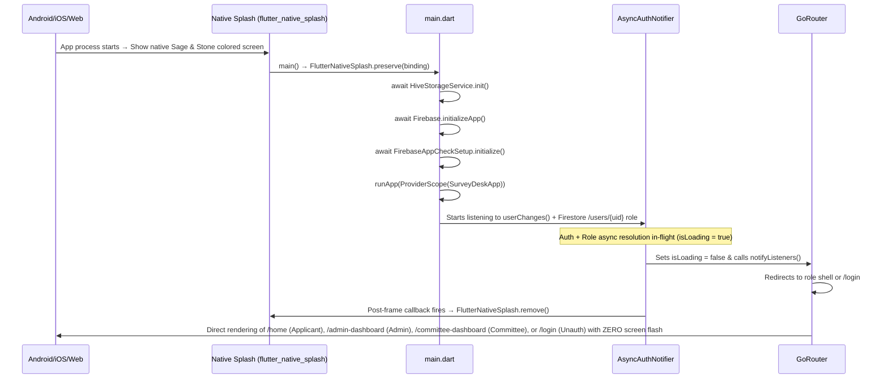
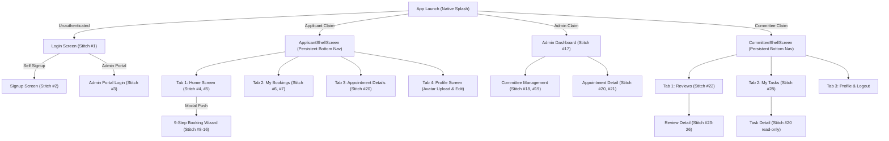

# 🎨 Frontend Architecture, Screens & State Management

**Parent Index:** [brain.md](file:///d:/flutter%20projects/survey_booking_app/brain/brain.md)

---

## 1. App Startup Sequence (Native Splash → Role-Aware Shell)

The app uses a single **native splash** strategy to eliminate the white-screen flash on cold start and handle heavy initialization seamlessly:

### Native Splash (`flutter_native_splash`) & Zero-Flash Startup
- **Config** (`pubspec.yaml`): `color: "#1B3B2B"` (Sage primary) / `color_dark: "#0D1611"` (Dark Sage) + `android_12` section.
- **Generated Files**: Android drawables/styles, iOS launch storyboard, Web CSS — all via `dart run flutter_native_splash:create`.
- **Preserved** in `main()` via `FlutterNativeSplash.preserve(widgetsBinding: binding)`.
- **Deferred Removal**: Instead of removing the splash in `main()` before auth resolves, `AsyncAuthNotifier` waits for the first `userChanges()` emission and Firestore `/users/{uid}` role fetch. It triggers `notifyListeners()` first to let GoRouter route to the target screen, and removes the splash in a `WidgetsBinding.instance.addPostFrameCallback` after the frame paints.
- **Why**: Eliminates cold-start white screen flashes and avoids the GoRouter redirect race condition where authenticated users might see a split-second flash of `/login` before landing on their respective dashboard. Unauthenticated users land directly on `/login` with 0ms visual jumping.

---

## 2. Stitch 28 Screens & 23 Screen Inventory Mapping

The application UI is guided by **28 Stitch Screen Designs** downloaded locally in `docs/stitch_assets/` and mapped onto the **23 Screen Inventory** across 3 roles:

---

## 3. Light & Dark Theme System (`flex_color_scheme: ^8.4.0`)

- **Theme Engine (`AppTheme`)**: Built with `FlexThemeData.light` & `FlexThemeData.dark` powered by `FlexScheme.greenM3` Material 3 design tokens.
  - **Typography**: Google Fonts Inter (`fontFamily: GoogleFonts.inter().fontFamily`).
  - **Sub-Themes (`FlexSubThemesData`)**: 
    - Interaction effects & tinted disabled controls enabled.
    - M2-style divider in M3 enabled.
    - Input decorator: filled, outline border type, `inputDecoratorRadius: 10`, content padding `16.w` x `14.h`.
    - Button shapes: `elevatedButtonRadius: 10`, `outlinedButtonRadius: 10`, `textButtonRadius: 10`.
    - Cards: `cardRadius: 12`.
    - Navigation: aligned dropdown, `navigationBarLabelBehavior: alwaysShow`, `navigationRailUseIndicator: true`.
    - Dark mode color blending: `blendOnColors: true`.
  - **Button Height Constraint**: 50dp minimum button height enforced via `ThemeData.copyWith` overrides on `elevatedButtonTheme` and `outlinedButtonTheme` (`minimumSize: WidgetStatePropertyAll(Size.fromHeight(50))`).
- **Adaptive Sizing Wrapper**: Wrapped with `flutter_screenutil_plus`'s `ResponsiveTheme.fromTheme(base)`.
- **Color Schemas & Semantic Badges (`lib/core/theme/app_colors.dart`)**:
  - `lightColorScheme` & `darkColorScheme`: Static `ColorScheme` constants generated with FlexColorScheme v8.4.0 stored for reference.
  - `AppStatusColors`: Dedicated semantic status colors (`pending: #E6A23C`, `inProgress: #409EFF`, `approved: #67C23A`, `rejected: #F56C6C`, `clarification: #909399`) used strictly for entity badges.
  - **UI Rule**: NEVER use hardcoded colors or static constants in UI. ALWAYS use `Theme.of(context).colorScheme` (`primary`, `primaryContainer`, `surface`, `error`, `outlineVariant`, etc.).
- **State Notifier**: Riverpod `themeProvider` (`ThemeNotifier`) — `ThemeMode.light`, `ThemeMode.dark`, `ThemeMode.system`.
- **Hive Persistence**: User theme choice saved across restarts via `HiveStorageService.setThemeMode` (`settingsBox`).

---

## 4. Screen Scaling (`flutter_screenutil_plus`)

- **Config in `main.dart`**: `ScreenUtilPlusInit(designSize: Size(375, 812), minTextAdapt: true, splitScreenMode: true, autoRebuild: false)`.
- **Sizing Extensions**: `.w`, `.h`, `.r`, `.sp`, `.spMin`, `context.w()`, `context.h()`, `context.sp()`.

---

## 5. Global Notification & Snackbar System (`AppSnackbar`)

- **Service**: Centralized `AppSnackbar` in `lib/core/utils/app_snackbar.dart` powered by `awesome_snackbar_content`.
- **Global Key**: `scaffoldMessengerKey: AppSnackbar.scaffoldMessengerKey` wired into `MaterialApp.router` in `main.dart` for context-less alerts when required.
- **Alert Variants**:
  - `showSuccess` / `showGlobalSuccess` (`ContentType.success`)
  - `showError` / `showGlobalError` (`ContentType.failure`)
  - `showWarning` / `showGlobalWarning` (`ContentType.warning`)
  - `showInfo` / `showGlobalInfo` (`ContentType.help`)
- **UI Presentation**: Floating behavior (`SnackBarBehavior.floating`), `elevation: 0`, `backgroundColor: Colors.transparent`, and automatic snackbar queue clearing (`hideCurrentSnackBar()`).

---

## 6. Routing, Auth State Sync & Back Button Interception (`GoRouter`)

- **Dynamic Refresh**: The router uses `AsyncAuthNotifier` listening to `FirebaseAuth.instance.userChanges()` and fetching the Firestore `/users/{uid}` role document before unblocking router redirects.
- **Auth Guards**: 
  - Unauthenticated users attempting to access protected routes are redirected to `/login`.
  - Authenticated *and* verified users attempting to access auth routes (`/login`, `/signup`, etc.) are actively redirected away to their role's root dashboard (`/home`, `/admin-dashboard`, `/committee-dashboard`).
- **StatefulShellRoute Back Navigation & `PopScope` Interception**:
  - `StatefulShellRoute.indexedStack` maintains isolated child `Navigator` instances for each tab branch across all 3 shells (`ApplicantShellScreen`, `AdminShellScreen`, `CommitteeShellScreen`).
  - Non-root branches are wrapped in `PopScope(canPop: false, onPopInvokedWithResult: ...)` to redirect to branch index 0 instead of exiting the application.
  - Branch 0 on each shell allows natural OS application exit.

---

## 7. Shared UI Components (Design System)

- **`AppButton`**: Centralized button widget with built-in `isLoading` state handling (replaces label with primary-colored spinner, disables tap).
- **`AppTextField`**: Standardized input fields with `SanitizingTextInputFormatter` built-in.
- **`SafeProfileAvatar`** (`lib/core/widgets/safe_profile_avatar.dart`): Profile image widget configured with `FirebaseAppCheckSetup.httpHeaders`, circular clipping, download progress spinner, and safe fallback container / icon handling.
- **`AppointmentStatusBadge`** (`lib/core/widgets/appointment_status_badge.dart`): Single source of truth for semantic appointment status badge presentation across all views (`HomeScreen`, `MyBookingsScreen`, `AppointmentDetailScreen`). Standardizes status colors (`AppStatusColors`), icons, labels, padding, and dark theme support via `Theme.of(context).colorScheme`.
- **`AppointmentBookingCard`** (`lib/core/widgets/appointment_booking_card.dart`): Reusable appointment card widget replacing repeated `_buildAppointmentCard` / `_buildBookingCard` implementations across `HomeScreen` and `MyBookingsScreen`. Standardizes card layout, formatted booking date (`intl` `MMM d, yyyy`), survey type label, tracking ID, status badge embedding, and tap navigation with `ref.read(selectedAppointmentIdProvider.notifier).select(item.id)` followed by `context.go(AppRoutes.appointmentDetailTab)`.

---

## 8. Applicant Modules (Home, Wizard, Bookings & Profile)

- **Applicant Home (`lib/features/applicant_home`)**:
  - `HomeViewModel`: AsyncNotifier fetching `upcomingSurveys`, `recentRequests`, and `recentActivity`.
  - `HomeScreen`: UI matching Stitch #4 & #5 with empty states, pull-to-refresh, standardized `AppointmentBookingCard` and `AppointmentStatusBadge` widgets, and dynamic greeting banner.
- **9-Step Booking Wizard (`lib/features/booking_wizard`)**:
  - `BookingWizardViewModel`: Riverpod `Notifier` managing wizard step transitions (1-9) with synchronous draft persistence via `HiveStorageService` (`wizard_draft_box`). Handles KML/KMZ upload and optional permission docs upload to Firebase Storage before Firestore creation with granular `onProgress` callbacks.
  - Steps 1 to 9: Survey Type, Punjab State & District dropdown, XEN Details, Survey Area & KML picker, Preferred Start Date, Logistics, Optional Permission Docs, Review & Submit with progress feedback, Acknowledgement.
- **My Bookings & Detail (`lib/features/my_bookings`)**:
  - `MyBookingsScreen`: Filterable appointment list with status chips matching Stitch #6, rendering list items via `AppointmentBookingCard`.
  - `AppointmentDetailScreen`: Read view for appointments with clarification reply submission matching Stitch #7, featuring centralized `AppointmentStatusBadge`.
    - **Riverpod State Management Optimization**: Decoupled clarification reply input and submission state from fragile local `setState` to prevent keyboard dismissal, textfield focus loss, and unnecessary screen re-renders during applicant interaction.
    - **Cross-Screen Cache Invalidation (`ref.invalidate`)**: When an applicant submits a clarification reply, `MyBookingsViewModel.submitClarificationReply` invokes `ref.invalidate(homeViewModelProvider)`. This ensures that when the applicant navigates back to `HomeScreen`, the recent requests cache is immediately refreshed and displays the new `under_review` badge rather than a stale `clarification_requested` status.
  - `AppointmentDetailTabScreen`: Persistent tab detail view within `StatefulShellRoute`.
- **Profile & Account (`lib/features/profile`)**:
  - `ProfileScreen`: Shared across all roles. Profile card with `SafeProfileAvatar`, edit modal bottom sheet, theme switcher, sign-out confirmation, and photo options bottom sheet offering upload/change and removal.
  - `ProfileViewModel`: `AsyncNotifier<void>` handling profile details update, photo upload, and photo removal pipeline with automatic cleanup of obsolete storage assets.

---

## 9. Button Layout Constraints & Theme Rule

- `AppTheme` sets `minimumSize: const Size.fromHeight(50)` on `elevatedButtonTheme` and `outlinedButtonTheme` (`width: double.infinity`).
- **Rule 1 (Row)**: Any button in a `Row` MUST be wrapped in `Expanded` (e.g. `Expanded(child: OutlinedButton(...))`) or styled with `minimumSize: Size.zero`. Never place an unconstrained button directly in a horizontal flex layout.
- **Rule 2 (ListTile)**: Never place an unconstrained `ElevatedButton` or `OutlinedButton` inside `ListTile.trailing` without `minimumSize: Size.zero`.

---

## 10. Admin Modules & Management

- **Admin Persistent Shell (`lib/features/admin_dashboard/view/admin_shell_screen.dart`)**:
  - Material 3 navigation bar across 4 branches: Dashboard (`/admin-dashboard`), Committees (`/admin-committees`), Add Member (`/admin-add-member`), and Settings (`/admin-settings`).
- **Admin Dashboard (`lib/features/admin_dashboard`)**:
  - `AdminDashboardViewModel`: Computes live status metrics (Pending, Under Review, Approved, Total) and manages search query + status chip filtering.
  - `AdminDashboardScreen`: UI matching Stitch #17 with statistical summary grid, horizontal filter chips, and request list tiles.
- **Committee Management (`lib/features/committee_management`)**:
  - `CommitteeManagementScreen`: Committee member directory with active/inactive segment tabs matching Stitch #18.
  - `AddCommitteeMemberScreen`: Form matching Stitch #19 triggering `createCommitteeMember` Cloud Function via `CommitteeManagementViewModel`. Upon successful creation, presents `_showCredentialsDialog` (non-dismissible modal) displaying Name, Email, and Temporary Password in styled `_CredentialRow` cards with `SelectableText`. Includes a one-touch "Copy" button (`Clipboard.setData`) for easy sharing and a "Done" button that clears the form and navigates back to the committee directory without memory leaks.
- **Admin Appointment Detail & Actions (`lib/features/admin_appointment_detail`)**:
  - `AdminAppointmentDetailScreen`: Detailed inspector matching Stitch #20 & #21, driven by `adminAppointmentDetailStreamProvider` and `AdminAppointmentDetailController`.
  - **Modal Action Sheets Architecture (`AssignReviewerSheet`, `AssignTaskSheet`, `SetConfirmedDateSheet`)**:
    - **Dismissal & Global Notification Sequence**: All modal sheets strictly dismiss first (`if (context.canPop()) context.pop()`) before calling `AppSnackbar.showGlobalSuccess` or `AppSnackbar.showGlobalError`. This eliminates the bug where snackbars were obscured behind the modal sheet barrier or dropped in the unmounted modal route stack.
    - **PopScope Submission Guard**: Wrapped in `PopScope(canPop: !_isSubmitting)` to disable Android back-gestures, system back button, or modal backdrop taps while network mutations are in-flight.
    - **Material Canvas & Ink Splash Handling**: Wrapped in `Material(color: Colors.transparent)` before child list widgets to avoid Flutter's `ListTile background color or ink splashes may be invisible` assertion on decorated containers.
    - **Flutter 3.32+ RadioGroup Pattern**: Wrapped in an ancestor `RadioGroup<AppUser>(groupValue: ..., onChanged: ...)` rather than placing deprecated `groupValue`/`onChanged` on individual `RadioListTile` widgets.
  - `AssignReviewerSheet`: Assigns committee reviewer for appointments in `pending_assignment` via `assignReviewer` Cloud Function.
  - `AssignTaskSheet`: Assigns fieldwork task member for approved appointments via `assignFieldworkTask` Cloud Function.
  - `SetConfirmedDateSheet`: Sets or edits confirmed survey date for approved appointments via `setConfirmedDate` Cloud Function.

---

## 11. Phase 5: Committee Member Portal Modules

- **Committee Persistent Shell (`lib/features/committee_dashboard/view/committee_shell_screen.dart`)**:
  - Material 3 navigation bar using `StatefulShellRoute.indexedStack` across 3 branches:
    1. Reviews (`/committee-dashboard`)
    2. My Tasks (`/committee-tasks`)
    3. Profile (`/committee-profile`, reuses `ProfileScreen`)
- **Committee Dashboard (`lib/features/committee_dashboard`)**:
  - `committeeDashboardStreamProvider`: `StreamProvider.autoDispose<List<Appointment>>` streaming review assignments where `assignedReviewerId == currentUser.uid`.
  - `CommitteeDashboardScreen`: UI matching Stitch #22 with segmented list sections:
    - **Awaiting Your Action**: Active reviews with status `under_review` or `clarification_requested`.
    - **Resolved**: Historical reviews with status `approved` or `rejected`.
    - Pull-to-refresh invalidates stream provider; isolated `_ErrorRetryView` and `_EmptyReviewsView` handle empty/error states cleanly.
- **Committee Review Details & Decision Portal (`lib/features/committee_review_detail`)**:
  - `committeeReviewDetailStreamProvider`: `StreamProvider.autoDispose.family<Appointment?, String>` streaming live document updates.
  - `CommitteeReviewDetailController`: Validates reviewer identity (`_checkReviewerRights()`) and enforces the PRD clarification rule before calling `reviewAppointment()`.
  - `CommitteeReviewDetailScreen`: UI matching Stitch #23 to #26 with full structured cards: Location, XEN Contact, Schedule, Logistics, Permission Documents list, Clarification Thread (with applicant reply), and Rejection Reason.
  - **Decision Actions**:
    - **Approve**: Sets status to `approved`.
    - **Request Clarification**: Opens `_TextInputSheet` (max 500 chars). Conditionally visible only if clarification has not already been sent without reply.
    - **Reject**: Opens `_TextInputSheet` for mandatory rejection reason (max 500 chars). Sets status to `rejected`.
- **Fieldwork Task Queue ("My Assigned Tasks") (`lib/features/assigned_tasks`)**:
  - `assignedTasksStreamProvider`: `StreamProvider.autoDispose<List<Appointment>>` streaming tasks where `assignedTaskMemberId == currentUser.uid`.
  - `AssignedTasksScreen`: UI matching Stitch #28 with survey details, prominent confirmed date indicator, pull-to-refresh, empty state, and tap-through to read-only task detail. Resolves the PRD Feature 7 committee fieldwork visibility gap.

---

## 12. Centralized Document Viewing (PDF Viewer) & KML/KMZ Download Infrastructure

To ensure applicants, committee reviewers, and administrators can inspect and verify all uploaded boundary files and permissions at any time, a shared document action ecosystem is integrated:

### Key Components
1. **`DocumentActionService` (`lib/core/services/document_action_service.dart`)**:
   - Resolves public/signed URLs from Storage reference paths or direct URLs via `FirebaseStorage.instance.ref(storagePath).getDownloadURL()`.
   - Downloads files via `Dio` into application temporary cache (`getTemporaryDirectory()`).
   - Uses `SharePlus` (`Share.shareXFiles()`) on mobile/tablet to prompt native system save/open sheets with fallback to browser launch on web.
   - Comprehensive error handling capturing network, storage, and platform failures with descriptive user messages.

2. **`PdfViewerScreen` (`lib/core/widgets/pdf_viewer_screen.dart`)**:
   - Built on `flutter_pdfview` with swipe horizontal/vertical scrolling, night mode, page indicator, error states, and retry logic.
   - Integrated AppBar action button allowing users to download/share the PDF file directly while viewing it.

3. **`SurveyDocumentTile` & `KmlFileTile` (`lib/core/widgets/survey_document_tiles.dart`)**:
   - Centralized UI components used consistently across:
     - **Applicant Appointment Detail** (`lib/features/my_bookings/view/appointment_detail_screen.dart`)
     - **Committee Review Detail** (`lib/features/committee_review_detail/view/committee_review_detail_screen.dart`)
     - **Admin Appointment Detail** (`lib/features/admin_appointment_detail/view/admin_appointment_detail_screen.dart`)
   - Provides visual indicators: PDF icon + "View" badge, and KML/KMZ icon + "Download" badge with in-tile progress spinners and error resilience.
