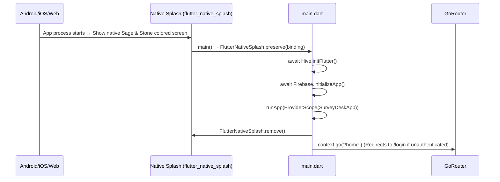
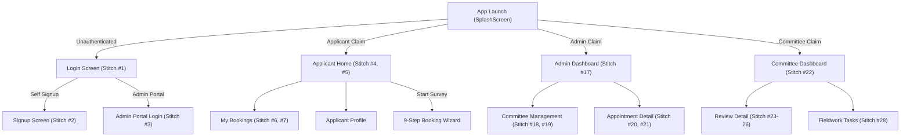

# 🎨 Frontend Architecture, Screens & State Management

**Parent Index:** [brain.md](file:///d:/flutter%20projects/survey_booking_app/brain/brain.md)

---

## 1. App Startup Sequence (Native Splash → Home)

The app uses a single **native splash** strategy to eliminate the white-screen flash on cold start and handle heavy initialization seamlessly:

### Native Splash (`flutter_native_splash`)
- **Config** (`pubspec.yaml`): `color: "#1B3B2B"` (Sage primary) / `color_dark: "#0D1611"` (Dark Sage) + `android_12` section.
- **Generated Files**: Android drawables/styles, iOS launch storyboard, Web CSS — all via `dart run flutter_native_splash:create`.
- **Preserved** in `main()` via `FlutterNativeSplash.preserve(widgetsBinding: binding)`.
- **Initialization**: Handles all heavy async initialization in `main()` (`Firebase.initializeApp()`, `Hive.initFlutter()`) while the native splash is visible.
- **Why**: Ensures the user sees the branded Sage & Stone color immediately on cold start, instead of a blank white screen while Flutter's engine and dependencies boot.

---

## 2. Stitch 28 Screens & 23 Screen Inventory Mapping

The application UI is guided by **28 Stitch Screen Designs** downloaded locally in `docs/stitch_assets/` and mapped onto the **23 Screen Inventory** across 3 roles:

---

## 3. Light & Dark Theme System

- **Light Mode (`AppTheme.lightTheme`)**: Deep Forest Green (`#1B3B2B`), Stone Gold (`#C49A45`), Light Background (`#F8F9FA`), Surface White (`#FFFFFF`).
- **Dark Mode (`AppTheme.darkTheme`)**: Deep Dark Sage (`#0D1611`), Dark Sage Surface (`#16241C`), Elevated Dark Card (`#1E3026`), Dark Border (`#2B4235`), Light Text (`#EDF2EE`).
- **Adaptive Text Scaling**: Wrapped with `flutter_screenutil_plus`'s `ResponsiveTheme.fromTheme(...)`.
- **State Notifier**: Riverpod `themeProvider` (`ThemeNotifier`) — `ThemeMode.light`, `ThemeMode.dark`, `ThemeMode.system`.
- **Hive Persistence**: User theme choice saved across restarts (`settingsBox`).
- **Theme Toggle Widget**: Reusable `ThemeToggleButton` for AppBars & Profiles.

---

## 4. Screen Scaling (`flutter_screenutil_plus`)

- **Config in `main.dart`**: `ScreenUtilPlusInit(designSize: Size(375, 812), minTextAdapt: true, splitScreenMode: true, autoRebuild: false)`.
- **Sizing Extensions**: `.w`, `.h`, `.r`, `.sp`, `.spMin`, `context.w()`, `context.h()`, `context.sp()`.
