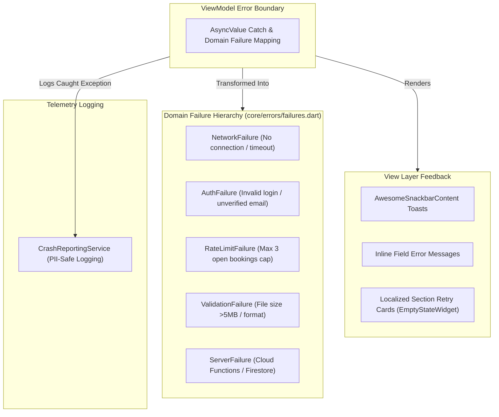
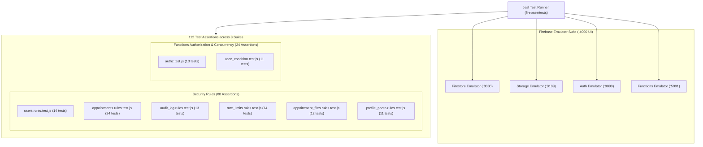

# 🧪 Testing, Quality, Graceful Error Handling & Observability

**Parent Index:** [brain.md](file:///d:/flutter%20projects/survey_booking_app/brain/brain.md)

---

## 1. Graceful Error Handling Strategy

To ensure zero app crashes and a resilient user experience across all network states and user roles:



### Domain Failure Classes (`lib/core/errors/failures.dart`):
- `NetworkFailure`: Connection drops or network timeouts.
- `AuthFailure`: Authentication failures, unverified email attempts, token expiry.
- `RateLimitFailure`: Enforces max 3 unresolved bookings cap.
- `ValidationFailure`: Phone number format, file size (>5MB), document extension checks.
- `ServerFailure`: Cloud Functions callable or Firestore transaction errors.

---

## 2. Observability & Monitoring Matrix

| Telemetry Tool | Tracked Target / Event | Privacy & Filtering Constraints |
|---|---|---|
| **Crashlytics Breadcrumbs & Context** | `setCustomKey('user_id', uid)`, `setCustomKey('role', role)` bound on auth and cleared on sign-out; `setCustomKey('current_wizard_step', stepName)` logged on every step transition; `log()` on upload/submission attempts | **STRICT PII BAN:** Never log applicant names, XEN phone/email, area names, or document contents |
| **Analytics Events** | `sign_up`, `login`, `booking_wizard_started`, `booking_submitted`, `review_action_taken` (`action: approve\|reject\|clarify`) | General event tracking; wizard step funnel events deferred to follow-up |
| **Performance Traces** | Automatic app start & network traces; custom traces for KML file uploads & `submitAppointment` call | Verifies submission latency stays within target performance budgets |

---

## 3. Testing Strategy & Quality Assurance

The application adopts a multi-tier testing pyramid consisting of Node.js Security Rules & Cloud Functions Integration Tests, Dart Integration Tests against the Firebase Emulator Suite, Riverpod Unit Tests, and responsive Widget Tests.

> 📖 **Complete Operations & Emulator Manual:** For an exhaustive operational guide covering setup, ports, Flutter CLI/IDE flags, live UI inspection, and troubleshooting, see [docs/firebase_emulator_user_manual.md](file:///d:/flutter%20projects/survey_booking_app/docs/firebase_emulator_user_manual.md).

### 3.1 Node.js Automated Test Suite (`firebase/tests/` — 112 Assertions across 8 Suites)

To guarantee strict compliance with authorization, RBAC constraints, rate-limit logic, and concurrent transaction safety before production deployment, the project maintains an automated Node.js test suite powered by `@firebase/rules-unit-testing` (v4.x), `firebase-admin` (v13.x), and `jest` (v29.x).

- **Root Directory:** `firebase/tests/`
- **Runner & Configuration:** `jest.config.js` (`testEnvironment: 'node'`, `testTimeout: 30000`, test matchers targeting `**/*.test.js`)
- **Project Isolation:** All tests run against the isolated project namespace `survey-desk-test`.



#### Test Matrix & Assertion Coverage (112 Assertions across 8 Suites):

| Test Suite File | Tested Resource | Assertions | Core Security & Concurrency Behaviors Verified |
|---|---|---|---|
| [`users.rules.test.js`](file:///d:/flutter%20projects/survey_booking_app/firebase/tests/firestore/users.rules.test.js) | `/users/{uid}` | 14 tests | • Any authenticated user can read profiles.<br>• Self-signup allows creating user doc only if `role == 'applicant'` and matching auth UID.<br>• Privilege escalation denied: Cannot self-assign `role: 'admin'` or `role: 'committee'`.<br>• Custom claim mismatch denied: User with `role == 'committee'` token cannot create doc with `role: 'applicant'`.<br>• Protected fields lockdown: Users cannot modify their own `role`, `uid`, or `email`.<br>• Admin full write privileges verified. |
| [`appointments.rules.test.js`](file:///d:/flutter%20projects/survey_booking_app/firebase/tests/firestore/appointments.rules.test.js) | `/appointments/{id}` | 24 tests | • Admin can read all appointments.<br>• Committee can only read appointments where assigned (`assignedReviewerId` or `assignedTaskMemberId`), not arbitrary ones.<br>• Applicants can read only their own appointments via identity (`applicantId == auth.uid`).<br>• **Token Claim Robustness:** Applicants without custom claims in token can read their own appointments and query by `where('applicantId', '==', auth.uid)`.<br>• Cross-user read denied for legacy/claim-less tokens.<br>• Unfiltered appointment queries denied for applicants.<br>• Unverified applicants cannot create appointments.<br>• Cross-applicant creation denied (`applicantId` mismatch).<br>• **Bypass Prevention:** Applicants cannot self-set `status` to `approved` on create.<br>• Applicants cannot tamper with `assignedReviewerId` or `assignedTaskMemberId`.<br>• Clarification reply flow: applicant can update only when `clarification_requested`. |
| [`audit_log.rules.test.js`](file:///d:/flutter%20projects/survey_booking_app/firebase/tests/firestore/audit_log.rules.test.js) | `/appointments/{id}/audit_log/{logId}` & `collectionGroup('audit_log')` | 13 tests | • Admin can read any appointment audit log.<br>• Committee member can read audit logs only for assigned appointments (verified via parent `get()`).<br>• Applicant can read audit logs only for own appointments.<br>• **Zero Client Write:** All client writes (create/update/delete) unconditionally denied (reserved for Cloud Functions Admin SDK).<br>• CollectionGroup queries restricted to Admins; Committee and Applicants denied broad collectionGroup reads. |
| [`rate_limits.rules.test.js`](file:///d:/flutter%20projects/survey_booking_app/firebase/tests/firestore/rate_limits.rules.test.js) | `/rateLimits/{id}` & `/auth_rate_limits/{id}` | 14 tests | • **Complete Client Lockdown:** `allow read, write: if false` verified for all client roles (Admin, Committee, Applicant, Unauthenticated).<br>• Admin SDK bypass verified: Server Cloud Functions can read/write rate limit state unimpeded. |
| [`appointment_files.rules.test.js`](file:///d:/flutter%20projects/survey_booking_app/firebase/tests/storage/appointment_files.rules.test.js) | `/appointments/{id}/kml/{file}` & `.../permissionDocuments/{file}` | 12 tests | • Admin can read/delete all appointment files.<br>• Committee can read files only if assigned on the appointment in Firestore (`isAssignedCommittee()` via `firestore.get()`).<br>• Owning applicant can read and upload files.<br>• Unverified applicants cannot upload files.<br>• File size enforcement: Permission docs <= 5MB, KML/KMZ <= 15MB.<br>• MIME type enforcement: PDF/JPG/PNG for docs.<br>• Immutability: Client `update` denied (create/delete only).<br>• Path traversal attacks rejected. |
| [`profile_photo.rules.test.js`](file:///d:/flutter%20projects/survey_booking_app/firebase/tests/storage/profile_photo.rules.test.js) | `/users/{uid}/profile/{fileName}` | 11 tests | • Authenticated users can read any profile photo.<br>• Users can upload/delete only in their own folder (`/users/{uid}/profile/`).<br>• Cross-user write/delete denied.<br>• Admin can write/delete any profile photo.<br>• Content type restricted to images (`image/jpeg`, `image/png`, etc.).<br>• File size capped at 5MB.<br>• File updates disallowed (must delete or overwrite cleanly). |
| [`authz.test.js`](file:///d:/flutter%20projects/survey_booking_app/firebase/tests/functions/authz.test.js) | 5 Callable Cloud Functions | 13 tests | • `submitAppointment`: Unauthenticated callers rejected (`UNAUTHENTICATED`). Committee roles rejected (`PERMISSION_DENIED`). Unverified emails rejected (`FAILED_PRECONDITION`). Missing mandatory fields rejected (`INVALID_ARGUMENT`). Verified applicants succeed.<br>• `createCommitteeAccount`: Unauthenticated and non-admin roles rejected (`PERMISSION_DENIED`). Deactivated admins rejected (`PERMISSION_DENIED`). Active admins succeed.<br>• `authenticateUser` & `requestPasswordReset`: Public unauthenticated endpoints accept caller inputs correctly. |
| [`race_condition.test.js`](file:///d:/flutter%20projects/survey_booking_app/firebase/tests/functions/race_condition.test.js) | `submitAppointment` Concurrency | 11 tests | • **Atomic Quota Enforcement:** Starting from 0, exactly 3 concurrent calls succeed.<br>• Burst of 4 calls: 4th concurrent call rejected with `RESOURCE_EXHAUSTED`.<br>• Burst of 10 calls: Exactly 3 succeed, 7 rejected with `RESOURCE_EXHAUSTED`.<br>• Quota persistence: With 2 existing appointments, a burst of 5 yields exactly 1 success and 4 rejected.<br>• Tenant isolation: Different applicants do not share rate limit buckets. Server enforces `status: pending_assignment` on all created appointments. |

---

### 3.2 Cloud Functions Testing & Helper Architecture (`firebase/tests/functions/test_helpers.js`)

2nd Gen Cloud Functions (`onCall`) validate incoming Bearer tokens using Google Identity Toolkit. To run realistic integration tests without hitting cloud infrastructure:
1. **True ID Token Minting (`getIdTokenForUser`)**: Tests mint a custom token via Admin SDK and exchange it with the local Auth emulator REST endpoint (`accounts:signInWithCustomToken`). This produces an authentic ID token with root claims (`role`, `email_verified`) recognized by Callable handlers.
2. **Direct Emulator Flush (`clearFirestore`)**: Directly calls `DELETE http://127.0.0.1:8080/emulator/v1/projects/survey-desk-test/databases/(default)/documents` to cleanly wipe database state between tests without relying on deprecated SDK methods.
3. **Local Secret Mock (`functions/.secret.local`)**: Supplies `AUTH_WEB_API_KEY` to satisfy Google Cloud Secret Manager bindings during local emulation.

---

### 3.3 Flutter Client Integration Test (`test/integration/firebase_emulator_test.dart`)

Validates client-side connectivity against local emulators without physical cloud dependencies:
- Verifies `FirebaseEmulator.connect()` binds Auth (:9099), Firestore (:8080), Storage (:9199), and Functions (:5001).
- Exercises end-to-end user registration, Firestore profile document reading, and custom token authentication against the local suite.
- Run via:
  ```bash
  flutter test test/integration/firebase_emulator_test.dart --dart-define=USE_FIREBASE_EMULATOR=true
  ```

---

### 3.4 Test Execution Guide

#### Method A: Automated One-Shot Execution (Spins up emulators, runs tests, exits)
```bash
# Run all Cloud Functions authorization & concurrency tests
firebase emulators:exec --project survey-desk-test --only auth,firestore,functions "npm --prefix firebase/tests run test:functions"

# Run Firestore Security Rules tests
firebase emulators:exec --project survey-desk-test --only firestore "npm --prefix firebase/tests run test:firestore"

# Run Storage Security Rules tests
firebase emulators:exec --project survey-desk-test --only firestore,storage "npm --prefix firebase/tests run test:storage"

# Run the complete test suite (all 108 assertions)
firebase emulators:exec --project survey-desk-test --only auth,firestore,storage,functions "npm --prefix firebase/tests test"
```

#### Method B: Interactive / Watch Session (Terminal 1 Emulators, Terminal 2 Tests)
```bash
# Terminal 1: Start emulator suite with Web UI on :4000
firebase emulators:start --project survey-desk-test

# Terminal 2: Run tests on demand or in watch mode
cd firebase/tests
npm run test:functions   # Functions tests
npm run test:firestore   # Firestore rules
npm run test:storage     # Storage rules
npm run test:watch       # Watch mode for active development
```

#### Running Dart Unit & Widget Tests:
```bash
# Analyze code for static quality (zero errors/warnings)
flutter analyze

# Run Flutter unit and widget tests
flutter test
```

---

## 4. Project Coding Conventions

- **State Management & DI:** Riverpod 2.x/3.x using `Provider`, `Notifier`, and `StateNotifier` (no code-generation build runners). Core providers exposed in `lib/core/providers/core_providers.dart`.
- **Linting & Formatting:** Enforced via `flutter_lints: ^6.0.0` defined in `analysis_options.yaml`. Zero lint warnings allowed in production code.
- **Color Discipline:** NEVER use hardcoded color constants or static `Colors.grey`/`AppColors` directly in UI components. Always resolve through `Theme.of(context).colorScheme` to ensure seamless dark mode adaptability. Use `AppStatusColors` solely for status badge semantics.

