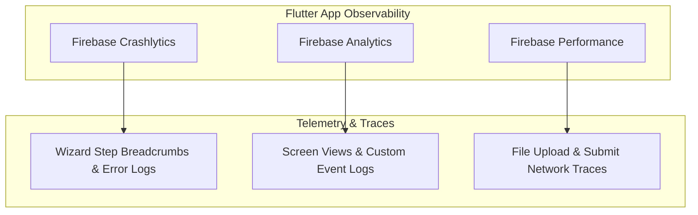

# 🧪 Testing, Quality & Observability Standards

**Parent Index:** [brain.md](file:///d:/flutter%20projects/survey_booking_app/brain/brain.md)

---

## 1. Observability & Monitoring Matrix



### Telemetry Implementation Specifications

| Telemetry Tool | Tracked Target / Event | Privacy & Filtering Constraints |
|---|---|---|
| **Crashlytics Breadcrumbs** | `setCustomKey('current_wizard_step', stepName)` logged on every step transition; `log()` on upload/submission attempts | **STRICT PII BAN:** Never log applicant names, XEN phone/email, area names, or document contents |
| **Analytics Events** | `sign_up`, `login`, `booking_wizard_started`, `booking_submitted`, `review_action_taken` (`action: approve\|reject\|clarify`) | General event tracking; wizard step funnel events deferred to follow-up |
| **Performance Traces** | Automatic app start & network traces; custom traces for KML file uploads & `submitAppointment` call | Verifies submission latency stays within target performance budgets |

---

## 2. Testing Strategy & Quality Assurance

```
Test Pyramid:
  ▲
 / \  E2E / Integration Tests (Firebase Emulator Suite)
/---\ Widget Tests (Wizard Step validation & Theme rendering)
/-----\ Unit Tests (ViewModels, Repositories & State Machines)
```

- **Unit Testing:** Tests business logic state transitions (e.g., single-clarification limit enforcement, rate limiting, wizard state validation) using `FakeAppointmentRepository`.
- **Widget Testing:** Tests responsive `LayoutBuilder` rendering across Compact (375dp) and Medium (768dp) width constraints.
- **Integration Testing:** Tests Cloud Functions and Firestore Security Rules end-to-end against the local Firebase Emulator Suite.

---

## 3. Project Coding Conventions

- **State Management:** Riverpod 2.x/3.x using hand-written `Notifier` and `AsyncNotifier` (no code-generation build runners).
- **Naming Conventions:**
  - Files & folders: `snake_case` (e.g., `appointment_repository.dart`)
  - Classes & Enums: `PascalCase` (e.g., `BookingWizardViewModel`)
  - Variables & Functions: `camelCase` (e.g., `submitAppointmentPayload`)
- **Linting & Formatting:** Enforced via `flutter_lints: ^6.0.0` defined in `analysis_options.yaml`. Zero lint warnings allowed in production code.
- **Documentation:** All public repository interfaces and core constants documented with concise DartDoc `///` comments.
