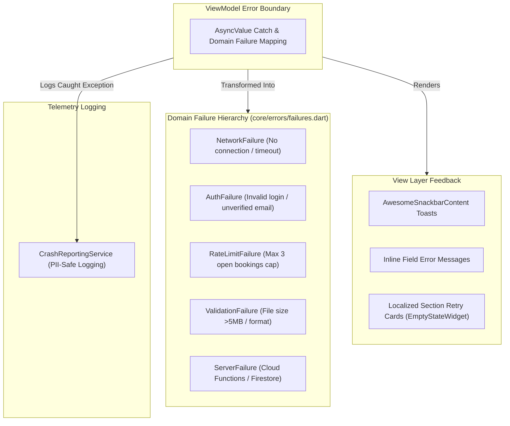

# 🧪 Testing, Quality, Graceful Error Handling & Observability

**Parent Index:** [brain.md](file:///d:/flutter%20projects/survey_booking_app/brain/brain.md)

---

## 1. Graceful Error Handling Strategy

To ensure zero app crashes and a resilient user experience across all network states and user roles:

### Domain Failure Classes (`lib/core/errors/failures.dart`):
- `NetworkFailure`: Connection drops or network timeouts.
- `AuthFailure`: Authentication failures, unverified email attempts, token expiry.
- `RateLimitFailure`: Enforces max 3 unresolved bookings cap.
- `ValidationFailure`: Phone number format, file size (>5MB), document extension checks.
- `ServerFailure`: Cloud Functions callable or Firestore transaction errors.

---

## 2. Observability & Monitoring Matrix

| Telemetry Tool | Tracked Target / Event | Privacy & Filtering Constraints |
|---|---|---|
| **Crashlytics Breadcrumbs** | `setCustomKey('current_wizard_step', stepName)` logged on every step transition; `log()` on upload/submission attempts | **STRICT PII BAN:** Never log applicant names, XEN phone/email, area names, or document contents |
| **Analytics Events** | `sign_up`, `login`, `booking_wizard_started`, `booking_submitted`, `review_action_taken` (`action: approve\|reject\|clarify`) | General event tracking; wizard step funnel events deferred to follow-up |
| **Performance Traces** | Automatic app start & network traces; custom traces for KML file uploads & `submitAppointment` call | Verifies submission latency stays within target performance budgets |

---

## 3. Testing Strategy & Quality Assurance

- **Unit Testing:** Tests business logic state transitions (e.g., single-clarification limit enforcement, rate limiting, wizard state validation) using `FakeAppointmentRepository`.
- **Widget Testing:** Tests responsive `LayoutBuilder` rendering across Compact (375dp) and Medium (768dp) width constraints.
- **Integration Testing:** Tests Cloud Functions and Firestore Security Rules end-to-end against the local Firebase Emulator Suite.

---

## 4. Project Coding Conventions

- **State Management & DI:** Riverpod 2.x using `Provider`, `Notifier`, and `StateNotifier` (no code-generation build runners). Core providers exposed in `lib/core/providers/core_providers.dart`.
- **Linting & Formatting:** Enforced via `flutter_lints: ^6.0.0` defined in `analysis_options.yaml`. Zero lint warnings allowed in production code.
