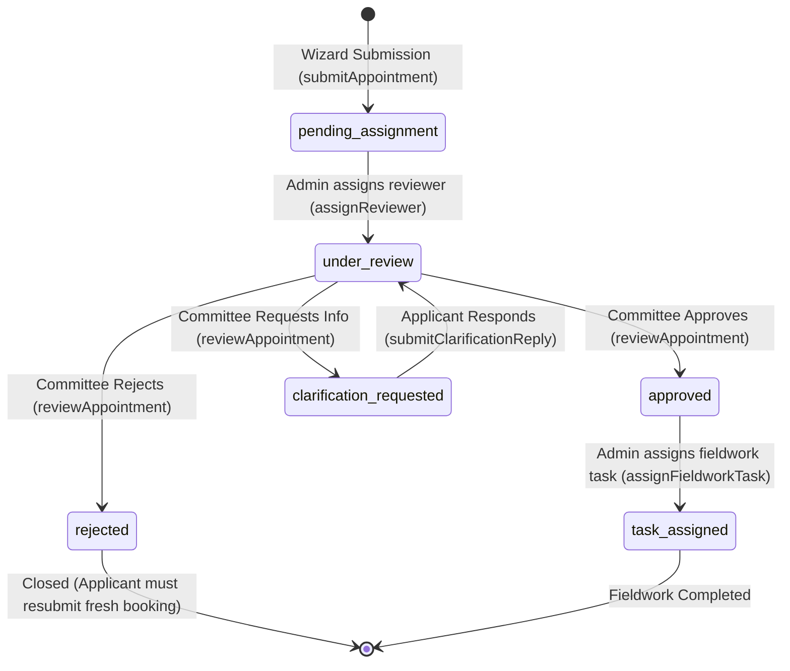
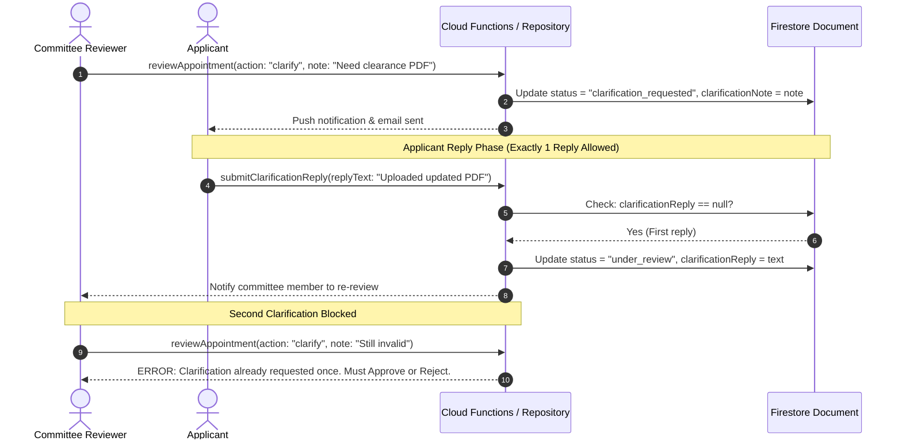
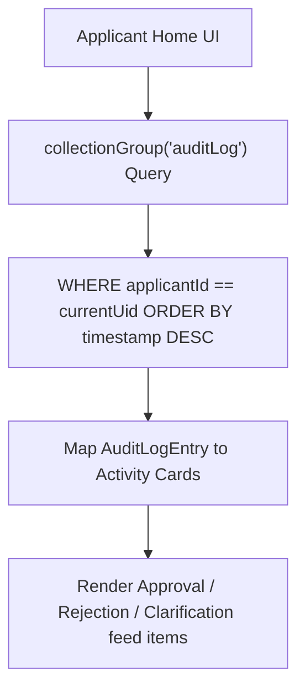
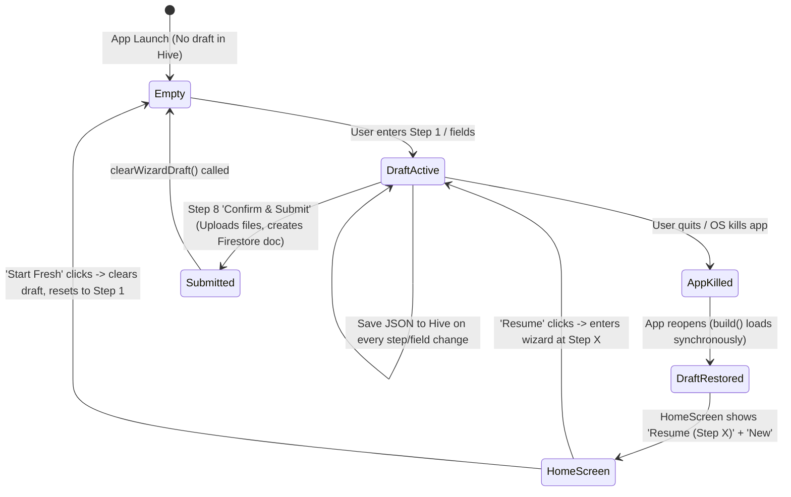
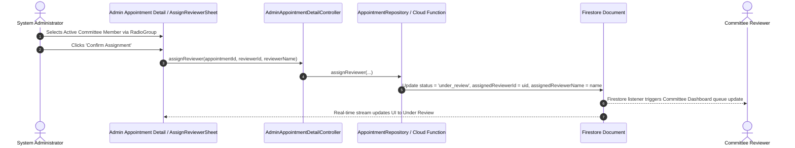
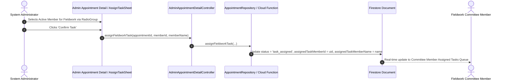
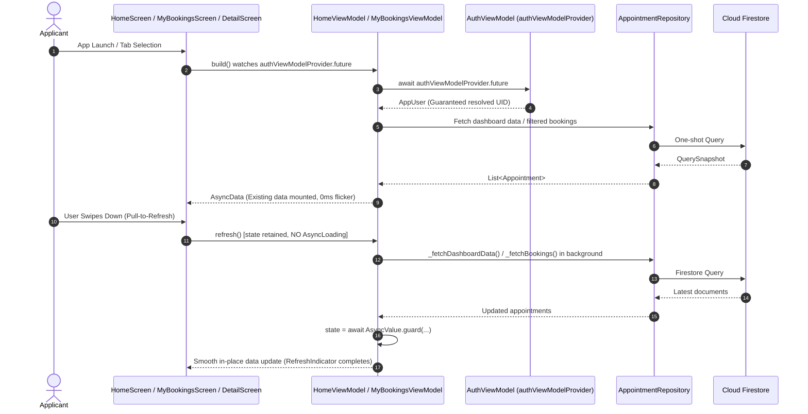

# 🔄 Workflows, Business Logic & State Machines

**Parent Index:** [brain.md](file:///d:/flutter%20projects/survey_booking_app/brain/brain.md)

---

## 1. Appointment 6-State Lifecycle State Machine

An appointment moves through 6 strictly governed status states:



### State Definitions & Permitted Operations

| State Name | Allowed Actions & Mutators | Permitted Next States |
|---|---|---|
| `pending_assignment` | Admin assigns reviewer via `assignReviewer` | `under_review` |
| `under_review` | Committee member reviews details, executes `reviewAppointment` | `approved`, `rejected`, `clarification_requested` |
| `clarification_requested` | Applicant submits single reply via `submitClarificationReply` | `under_review` |
| `approved` | Admin sets `confirmedDate` or assigns fieldwork task via `assignFieldworkTask` | `task_assigned` |
| `rejected` | Terminal state. Contains mandatory `rejectionReason` (max 500 chars) | None |
| `task_assigned` | Active fieldwork assigned to committee member (`assignedTaskMemberId`) | Terminal |

---

## 2. Core Business Workflows

### A. Clarification Roundtrip Workflow (Single-Reply Limit)



#### Client-Side State Synchronization & Cache Invalidation (`ref.invalidate`)

When the applicant submits `submitClarificationReply`, Firestore updates the appointment status from `clarification_requested` to `under_review`.
Because `HomeScreen` uses `HomeViewModel` (which loads recent requests via a one-shot `Future`), navigating back to `HomeScreen` without cache invalidation would cause the home screen to display stale cached data with the old `clarification_requested` badge.
To prevent this desynchronization, `MyBookingsViewModel.submitClarificationReply` invokes `ref.invalidate(homeViewModelProvider)` immediately upon a successful repository call. This forces `HomeViewModel` to re-fetch the latest appointment statuses, ensuring the Home dashboard and My Bookings tab stay strictly synchronized with `under_review` badges.

---

### B. Home Screen Recent Activity Feed Aggregation

The applicant Home screen displays a unified feed of status transitions across all their appointments:



> **Performance Strategy:** By denormalizing `applicantId` onto every `auditLog` subcollection document, the client runs a single indexed `collectionGroup` query rather than querying every individual appointment document's history separately.

---

### C. Admin Confirmed Date Management

Admins can set or modify the `confirmedDate` independently of the applicant's original `preferredDate`.
- `preferredDate`: Set during wizard Step 5 (applicant request).
- `confirmedDate`: Set post-approval via `setConfirmedDate` Cloud Function. Displayed prominently in the Applicant's "Upcoming Scheduled Surveys" list and the Committee's "My Assigned Tasks" queue.

---

### D. Booking Wizard Draft Lifecycle & App-Kill Resilience



---

### E. Admin Reviewer Assignment Workflow



---

### F. Post-Approval Fieldwork Task Assignment Workflow



---

### G. Committee Review Decision & Fieldwork Task Lifecycle (Phase 5)

> **CRITICAL SECURITY ARCHITECTURE**:  
> Direct client-side updates to `/appointments/{id}` are strictly rejected by `firestore.rules` (`allow update: if false;`). All review decisions MUST flow through the 2nd Gen HTTPS Callable Cloud Function `reviewAppointment` via `FirebaseAppointmentRepository`.

```mermaid
sequenceDiagram
    autonumber
    actor Comm as Committee Member
    participant CD as CommitteeDashboardScreen
    participant RD as CommitteeReviewDetailScreen
    participant VM as CommitteeReviewDetailController
    participant Repo as FirebaseAppointmentRepository
    participant CF as Cloud Function (reviewAppointment)
    participant FS as Firestore (Admin SDK)

    Comm->>CD: Opens 'Reviews' Tab (committeeDashboardStreamProvider)
    CD-->>Comm: Shows 'Awaiting Your Action' vs 'Resolved' lists
    Comm->>RD: Taps appointment card (/committee-review/:id)
    RD-->>Comm: Renders location, XEN, schedule, logistics, permission docs
    
    alt Approve Decision
        Comm->>RD: Taps 'Approve'
        RD-->>Comm: Presents confirmation dialog (_showApproveDialog)
        Comm->>RD: Confirms 'Approve'
        RD->>VM: approve(appointment) [Shows inline button spinner]
        VM->>Repo: updateAppointmentStatus(appointment, approved)
        Repo->>CF: httpsCallable('reviewAppointment')({ action: 'approve' })
        Note over CF,FS: Atomic Firestore Transaction
        CF->>FS: Update status = 'approved', updatedAt = now
        CF->>FS: Decrement rateLimits/{applicantId}.pendingCount by 1
        CF->>FS: Append immutable /appointments/{id}/auditLog entry
        CF-->>Repo: { success: true, newStatus: 'approved' }
        Repo-->>VM: Success
        VM->>VM: ref.invalidate(committeeDashboardStreamProvider)
        VM-->>RD: Show AppSnackbar success
        FS-->>CD: Real-time stream updates list; moves to 'Resolved'
    else Request Clarification
        Comm->>RD: Taps 'Request Clarification'
        RD-->>Comm: Shows _TextInputSheet (max 500 chars)
        Comm->>RD: Submits clarification note
        RD->>VM: requestClarification(appointment, note) [Shows inline spinner]
        VM->>Repo: updateAppointmentStatus(appointment, clarification_requested, note)
        Repo->>CF: httpsCallable('reviewAppointment')({ action: 'clarify', note })
        CF->>FS: Update status = 'clarification_requested', clarificationNote = note
        CF->>FS: Append auditLog entry
        CF-->>Repo: { success: true }
        Repo-->>VM: Success
        VM->>VM: ref.invalidate(committeeDashboardStreamProvider)
        FS-->>RD: Re-renders showing clarification thread awaiting reply
    else Reject Decision
        Comm->>RD: Taps 'Reject'
        RD-->>Comm: Shows _TextInputSheet (mandatory reason, max 500 chars)
        Comm->>RD: Submits rejection reason
        RD->>VM: reject(appointment, reason) [Shows inline spinner]
        VM->>Repo: updateAppointmentStatus(appointment, rejected, reason)
        Repo->>CF: httpsCallable('reviewAppointment')({ action: 'reject', reason })
        Note over CF,FS: Atomic Firestore Transaction
        CF->>FS: Update status = 'rejected', rejectionReason = reason
        CF->>FS: Decrement rateLimits/{applicantId}.pendingCount by 1
        CF->>FS: Append immutable auditLog entry
        CF-->>Repo: { success: true }
        Repo-->>VM: Success
        VM->>VM: ref.invalidate(committeeDashboardStreamProvider)
        VM-->>RD: Show AppSnackbar success
        FS-->>CD: Real-time stream updates list; moves to 'Resolved'
    end
```

---

### H. Applicant Dashboard & Booking Pull-to-Refresh Lifecycle



- **Non-Collapsing Refresh**: ViewModel `refresh()` never emits `state = const AsyncLoading()`. The current widget tree remains fully mounted while fresh data is retrieved, preventing layout collapse, jitter, and infinite refresh loops.
- **Scroll Metric Preservation**: `RefreshIndicator` is provided an active scrollable child (`AlwaysScrollableScrollPhysics` with `ConstrainedBox(minHeight: constraints.maxHeight)`) across all UI states (Data, Empty, Error).
- **Tab State Preservation**: `AppointmentDetailTabScreen` evaluates `if (bookingsState.hasValue)` to keep the active `AppointmentDetailScreen` mounted during background list refreshes.

