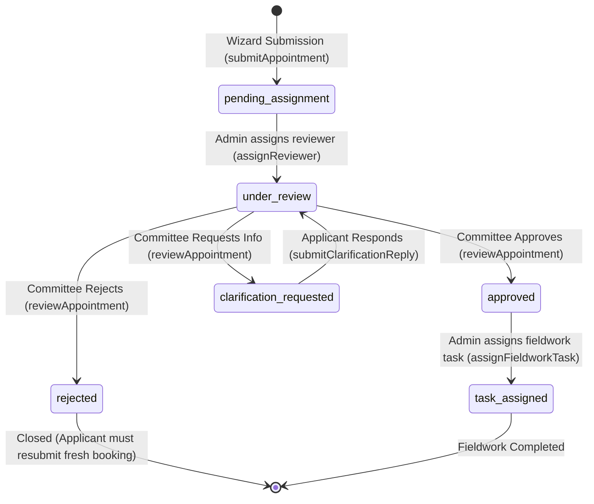
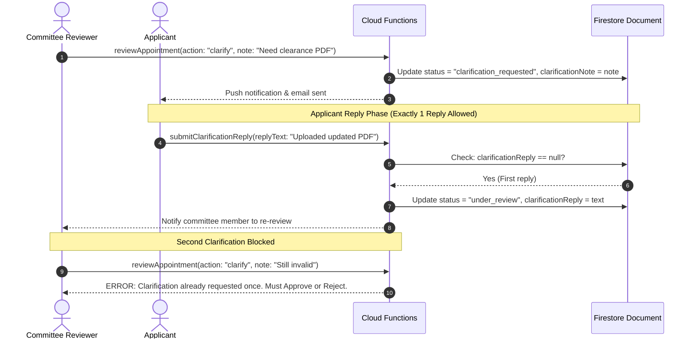
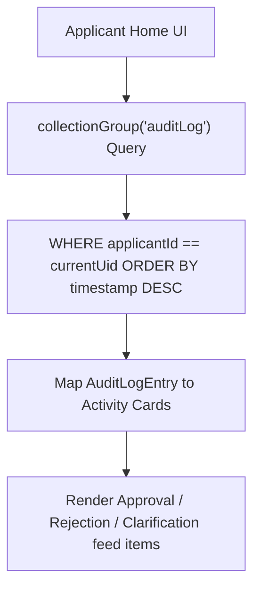

# 🔄 Workflows, Business Logic & State Machines

**Parent Index:** [brain.md](file:///d:/flutter%20projects/survey_booking_app/brain/brain.md)

---

## 1. Appointment 6-State Lifecycle State Machine

An appointment moves through 6 strictly governed status states:

### State Definitions & Permitted Operations

| State Name | Allowed Actions & Mutators | Permitted Next States |
|---|---|---|
| `pending_assignment` | Admin assigns reviewer via `assignReviewer` | `under_review` |
| `under_review` | Committee member reviews details, executes `reviewAppointment` | `approved`, `rejected`, `clarification_requested` |
| `clarification_requested` | Applicant submits single reply via `submitClarificationReply` | `under_review` |
| `approved` | Admin sets `confirmedDate` or assigns fieldwork task via `assignFieldworkTask` | `task_assigned` |
| `rejected` | Terminal state. Contains mandatory `rejectionReason` (max 500 chars) | None |
| `task_assigned` | Active fieldwork assigned to committee member (`assignedTaskMemberId`) | Terminal |

---

## 2. Core Business Workflows

### A. Clarification Roundtrip Workflow (Single-Reply Limit)

---

### B. Home Screen Recent Activity Feed Aggregation

The applicant Home screen displays a unified feed of status transitions across all their appointments:

> **Performance Strategy:** By denormalizing `applicantId` onto every `auditLog` subcollection document, the client runs a single indexed `collectionGroup` query rather than querying every individual appointment document's history separately.

---

### C. Admin Confirmed Date Management

Admins can set or modify the `confirmedDate` independently of the applicant's original `preferredDate`.
- `preferredDate`: Set during wizard Step 5 (applicant request).
- `confirmedDate`: Set post-approval via `setConfirmedDate` Cloud Function. Displayed prominently in the Applicant's "Upcoming Scheduled Surveys" list.
